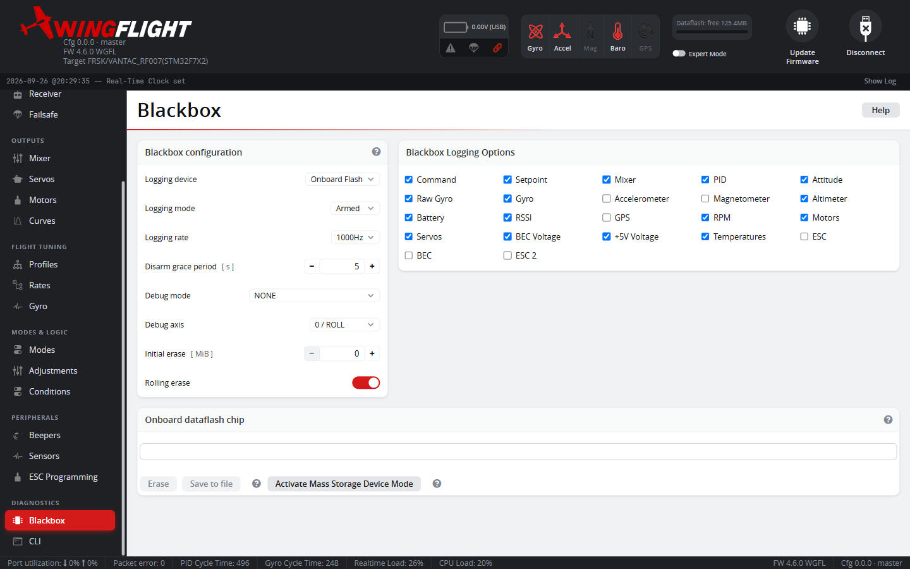
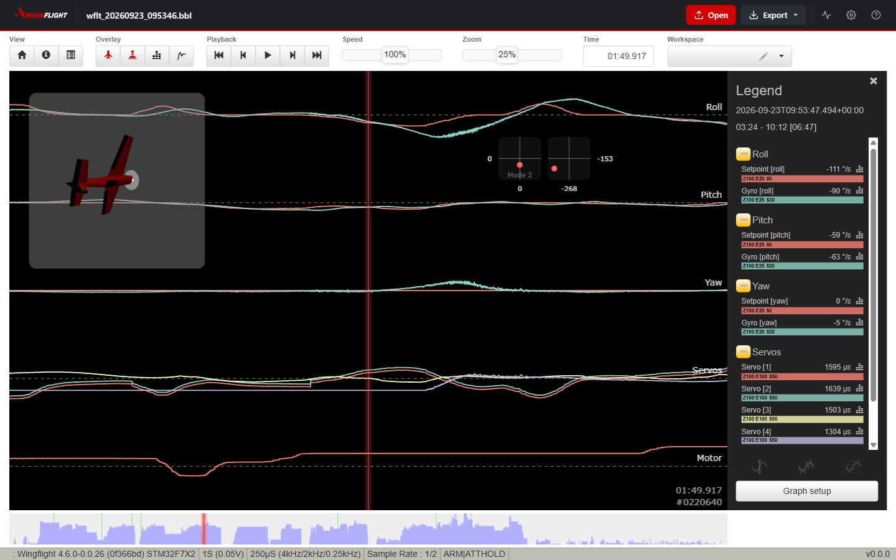
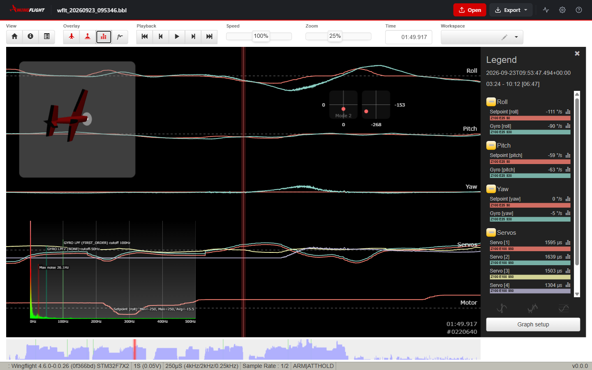
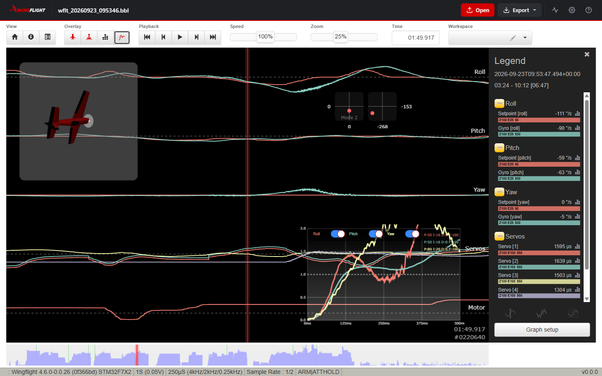

# Blackbox

The Blackbox tab configures flight-data logging -- which fields are
recorded, logging rate, and (if fitted) onboard flash/SD storage management.
Blackbox logs are the primary tool for diagnosing tuning issues after a
flight, and are usually the first thing to attach when asking for tuning
help.

## When it logs

**Device** picks where logs go: onboard flash, an SD card, or an external
serial logger (each only appears if actually fitted/supported). **Mode**
then decides when logging is active: **Armed** (simplest -- logs every
flight), **Normal** (logs only when armed *and* a Blackbox switch is
active, for keeping only flights you deliberately flag), or **Switch**
(logs whenever that switch is active, armed or not). **Grace Period**
keeps logging briefly after disarming, specifically to catch the moments
right after a crash rather than cutting off exactly at disarm.

## Rate and fields

**Rate of Logging** is a divisor of the PID loop rate -- higher rates
capture more detail (useful for chasing a specific fast oscillation) at
the cost of filling storage faster; lower rates log longer flights in the
same space. The field checkboxes choose which data categories are
recorded at all -- turn off what you don't need to save space, but when in
doubt for a tuning question, leave gyro/PID/setpoint data on since that's
what most tuning advice is read from.

**Debug Mode** adds a further 8 extra values on top of the normal fields,
for a specific diagnostic (its exact meaning depends on which mode is
selected) -- leave it on `NONE` unless you're chasing something specific
that calls for it. Modes inherited from Rotorflight that no longer record
anything are named `UNUSED_<n>` and are left out of the list; see
[CLI reference → Debug modes](../../reference/cli-reference.md#debug-modes).

## Flash storage

**Initial Erase** guarantees a minimum amount of free space before
recording starts, erasing old logs if needed -- note that erasing can take
a while on some flash chips, so recording doesn't begin until it finishes.
**Rolling Erase** instead overwrites the oldest logs once storage is full,
trading guaranteed history for never running out of space -- logs can gain
gaps if the chip is slow to erase mid-flight.

## Reading flight-mode changes in logs

Each periodic log frame records which flight modes are active in two
words, `flightModeFlags` and `flightModeFlags2`, together covering every
mode. Older firmware logged only the first word, which silently dropped
every mode past the 32nd -- including GYRO OFF (MANUAL in older firmware) -- so a GYRO OFF
segment never showed as engaged. If you read logs with a tool that only
knows `flightModeFlags`, modes such as GYRO OFF need `flightModeFlags2`
too. The separate flight-mode change *event* still carries only the
first word.

## Log files over USB

When the flight controller is plugged in as a USB drive (mass storage), log
files are named after the craft name from your pilot settings, followed by
a sequence number and timestamp. With no craft name set, the prefix is
`wflt` (it used to be `rtfl`), for example `wflt_002_20251012_141213.bbl`.

## Reviewing logs

Open a `.bbl` file in the WingFlight Blackbox viewer to play the flight
back. Each graph stacks related fields -- here, setpoint against gyro for
each axis, then the servo outputs and motor -- with the legend on the right
showing every field's value at the red cursor line. The craft model and
stick overlays follow the cursor, and the strip along the bottom shows the
whole log so you can jump to any part of the flight. The status bar lists
the firmware, loop rate, and flight modes active at the cursor (here `ARM`
and `ATTHOLD`). **Graph setup** chooses which fields each graph shows.

The **Overlay** buttons add analysis views on top of the graphs. The
spectrum analyser plots the frequency content of a field over the visible
window, with the gyro filter cutoffs marked -- useful for finding the
frequency of a vibration before changing filter settings.

The step response graph shows how quickly and cleanly the gyro follows a
change in setpoint on roll, pitch and yaw, with each axis' PID gains noted
alongside. A trace that overshoots well past 1.0 or keeps ringing points to
gains that are too high on that axis.

