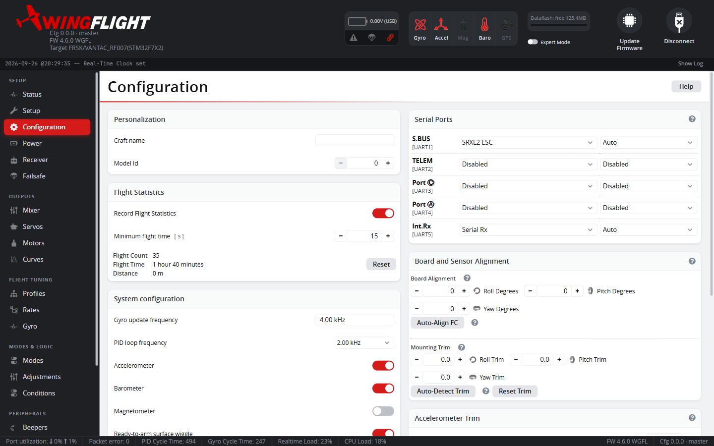

# Configuration

The Configuration tab covers system-level setup that doesn't belong to a
more specific tab: board/sensor alignment, ESC/motor protocol selection,
arming behavior, and other one-time-per-build settings.



Board alignment in particular is worth getting right early -- if the flight
controller isn't mounted flat/forward in the airframe, the alignment offsets
here correct for that so the IMU's reported attitude matches reality.

## Board Alignment

Board Alignment is the coarse correction for how the FC is physically
mounted, typically in 90° steps (sideways, upside down, rotated). Rather
than working out the rotation by hand, **Auto-Align FC** detects it for you:
place the aircraft flat and disarmed, press Start, then briefly lift the
tail by at least 20° -- the wizard reads the resulting accelerometer
movement and reports the detected roll/pitch/yaw. It requires a calibrated
accelerometer and only runs while disarmed.

## Mounting Trim

Mounting Trim is a separate, fine-grained correction (in degrees) for a
mounting surface that isn't perfectly level, applied *after* Board Alignment
rather than by adjusting it. Keeping the two independent matters because
Board Alignment's roll/pitch/yaw are composed in a fixed order -- once a
large 90°-step correction lands on one axis, a small correction entered as
more board alignment can visually show up on the wrong axis. Mounting Trim
always corrects the intended physical axis regardless of the board
alignment already set.

Roll and pitch mounting trim can be auto-detected the same way as board
alignment (place the aircraft level and disarmed, press Start, don't touch
it) -- yaw can't be measured from a resting accelerometer and stays manual.
If the residual tilt is too large (over 30°), that usually means Board
Alignment itself is wrong; run Auto-Align FC first, then retry.

Mounting Trim rotates the gyro as well as the accelerometer. Use it to line
the FC up with the axis the aircraft rolls about (roughly the thrust line),
not to make the horizon read level. To move the level reference for the
self-leveling modes, use `acc_trim_pitch` / `acc_trim_roll` instead: these
change only the attitude the leveling modes aim for and leave the gyro axes
alone. Auto-detect sets the trim so that the resting accelerometer reads
level, so run it with the thrust line level. With a taildragger resting on
its tail wheel, auto-detect measures the ground angle, and that angle ends
up in the trim.

### Yaw that follows roll

**Symptom:** the aircraft swings in yaw whenever it rolls, worst in fast
rolls, and changing the yaw PIDs or rates makes little difference. In a
Blackbox log, with the rudder stick centred, the yaw gyro follows the roll
gyro at a fixed ratio: there is no delay, and the ratio is the same upright,
inverted and in knife edge. The yaw I-term builds up during each roll and
drives the rudder against it.

**Cause:** the gyro's yaw axis isn't square to the axis the aircraft
actually rolls about. A pitch tilt of θ makes the yaw gyro read
`sin θ × roll rate` even when the aircraft isn't yawing; about 5° gives
around 9%, which is 60°/s of false yaw in a 700°/s roll. The yaw loop
cancels that false reading with real rudder, so the aircraft really does
yaw. A pitch Mounting Trim set to level the horizon on the ground is a common
source; a tilted FC tray is another.

Real airframe coupling looks different. Rolling about the flight path at an
angle of attack reverses sign when inverted. Adverse yaw from the ailerons
lags the stick and follows aileron deflection, not roll rate.

**Fix:** measure the ratio `k` = yaw gyro ÷ roll gyro in fast rolls with
the rudder centred, then change `align_board_trim_pitch` by about
`−573 × k` (decidegrees), adding to the current value rather than
replacing it:

```
get align_board_trim_pitch      # e.g. -67
set align_board_trim_pitch = -17   # k = -0.09: -67 + 52
save
```

If the coupling gets worse, the sign is reversed: go the other way from the
original value. If the horizon then reads off in the leveling modes, correct
it with `acc_trim_pitch`, not with Mounting Trim. To confirm the fix, fly
fast rolls with the rudder centred: yaw rate and rudder mixer output should
stay near zero.
