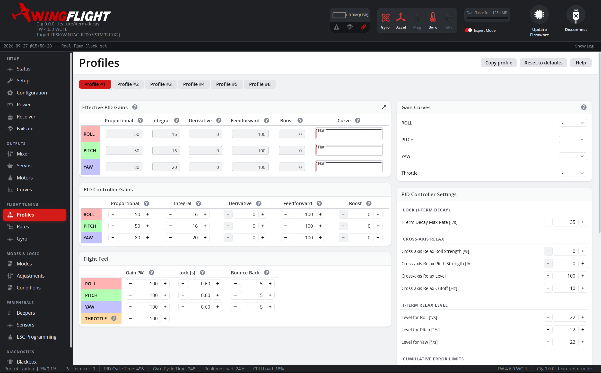

# Profiles

The Profiles tab manages PID tuning profiles -- the actual stabilization
gains that control how tightly the flight controller holds your commanded
attitude.

Multiple profiles can be configured and switched between in flight (via an
[Modes](auxiliary.md) mode mapping), which is useful for having distinct
tunes for, e.g., calm cruising versus aggressive 3D/aerobatic flight on the
same airframe.

## PID Gains

The PID Gains table holds the actual per-axis P, I, D, F (Feedforward), and B
(Boost) terms -- the static tune itself, as distinct from Master Gain below,
which scales it live rather than editing it directly.

Most people tune by feel in the air, not by reasoning about control theory,
so here's what each one is actually doing to the way the plane flies rather
than a textbook definition:

- **P** is how locked-in the plane feels to your stick and to gusts. Too
  little and it's floppy/mushy -- slow to respond, wanders off your line.
  Too much and it gets nervous: a fast buzz or bounce-back right after a
  sharp input.
- **I** is what holds a turn, a knife-edge, or a heading exactly, rather than
  approximately. Too little and it slowly bleeds off the line in wind or if
  the CG's slightly off. Too much and it wallows -- a slow wandering
  oscillation, or the plane keeps rotating a beat after you've already
  centered the stick.
- **D** is the shock absorber: it stops P's correction from overshooting and
  soaks up a gust before it upsets the plane. Too little and inputs
  overshoot, and gusts knock the plane around more than they should. Too
  much and servos start to growl, buzz, or run hot -- D is by far the most
  noise-sensitive term, so if you're chasing heat/buzzing here, check
  [Gyro](gyro.md) filtering first.
- **F** is what makes stick input feel instant instead of rubbery -- it
  pushes toward where you're asking the plane to go the moment you move the
  stick, rather than waiting for it to fall behind first. Too little feels
  delayed, and the plane keeps rotating briefly after you let go of the
  stick. Too much snaps past where you wanted and kicks back
  ("strikeback") as the stick returns to center.
- **B** is a finishing touch on top of F, reacting to how *fast* you move
  the stick rather than how far. Too little and quick flicks feel
  soft/rounded; too much and quick flicks get twitchy, sharing D's noise
  sensitivity.

### F and MANUAL mode

F also sets how far the surfaces move in **MANUAL** mode (stabilization
off, sticks straight to the servos). MANUAL is scaled through the same
F-term the stabilized loop uses -- "stabilized flight minus the gyro
correction" -- so a well-tuned F puts MANUAL's throw in the neighborhood of
what the stabilized modes settle to in flight, instead of it depending on
the rates ceiling as it once did. Judge the match in the air: a stationary
airframe on the bench never rotates far enough for the two to look alike.

!!! warning
    Because MANUAL is scaled through F, it is only as big as your F and rates
    allow. With the default F of 100, a rate of 400 deg/s gives full surface
    travel. Halve F, or lower the rates, and MANUAL travel shrinks with them.
    **F = 0 gives no surface movement at all in MANUAL.** If you use MANUAL
    as a fallback when the stabilization misbehaves, check on the bench that
    full stick still gives full travel.

### Quick troubleshooting

| What you're seeing in the air | Try |
|---|---|
| Floaty/mushy, wanders off your line | Raise P |
| Bounces or buzzes right after a sharp stick input | Lower P (or raise D) |
| Overshoots a gust or fast input before settling | Raise D |
| Servos growl, buzz, or run hot | Lower D, check [Gyro](gyro.md) filtering |
| Stick input feels laggy or rubbery | Raise F |
| Keeps drifting/rotating a moment after you center the stick | Lower I; if it's only on quick inputs, raise F instead |
| Feels too locked in, pushes back after a manoeuvre (3D) | Shorten [I-Term Decay Time](#i-term-decay-time) |
| Wanders with gusts, doesn't feel pinned | Lengthen [I-Term Decay Time](#i-term-decay-time) |
| Heading wanders in knife-edge or hover | Lengthen yaw [I-Term Decay Time](#i-term-decay-time) only |
| Snaps past the input and kicks back as you release the stick | Lower F |
| Quick flicks feel twitchy/nervous | Lower B |
| Quick flicks feel soft, no snap | Raise B |

Master Gain and its curve (below) scale P, I, and D together as one
percentage -- F (Feedforward) and Boost are tuned independently per-axis
and aren't affected by Master Gain.

### Why these defaults

Out of the box:

| | P | I | D | F | B |
|---|---|---|---|---|---|
| Roll | 50 | 16 | 0 | 100 | 0 |
| Pitch | 50 | 16 | 0 | 100 | 0 |
| Yaw | 80 | 20 | 0 | 100 | 0 |

The standout choice is **D = 0 on every axis**. A fixed-wing control
surface doesn't live in a particularly noisy, high-vibration environment,
so the default tune leans on Feedforward (already set to a meaningful
F = 100 out of the box) for a responsive, instant-feeling stick rather than
D-driven damping. Add D deliberately if a specific airframe overshoots or
wallows in gusts -- and check [Gyro](gyro.md) filtering first, since D is
the term most likely to expose noise once it's non-zero.

I is also deliberately kept low relative to P (16-20 vs. 50-80) -- don't
read that gap as I being "weak." I isn't left to accumulate freely the way
a raw integrator would: [I-Term Decay Time](#i-term-decay-time) (0.60 s by default) continuously
bleeds accumulated I-term error back off, capped by an I-Term Decay Max
Rate (35°/s), and I-Term Relax (level 22, cutoff 10Hz by default)
specifically suppresses I buildup while the stick is moving quickly, to
avoid bounce-back at the end of a roll or other fast maneuver. Because
something else is actively managing decay, a small I gain is enough to
hold a steady bias (wind, a CG offset) -- pushing I up to "match" P instead
just reintroduces the slow wallowing oscillation the decay/relax defaults
are there to avoid.

Yaw runs a bit hotter than Roll/Pitch (P 80 vs. 50, I 20 vs. 16) since
rudder authority and yaw stability vary more from airframe to airframe than
aileron/elevator response typically does.

Boost defaults to 0 -- it's a finishing touch layered on an already-working
Feedforward tune, not something you'd want fighting an airframe that hasn't
been flown and trimmed yet.

Master Gain defaults to 100% (no scaling) with no curve assigned on every
axis, and Throttle (TPA) likewise defaults to 100% with no curve -- so the
PID Gains table above is exactly what flies until you deliberately assign a
curve or an Adjustments knob.

## Master Gain

Master Gain sets one overall gain per axis (Roll, Pitch, Yaw) that scales
the P, I, and D terms of that axis's PID loop -- F (Feedforward) and Boost
stay at their static configured values -- each with its own optional gain
curve so the scaling can vary with stick position rather than applying a
single flat multiplier. In expert mode a fourth row, Throttle (TPA),
attenuates gains across the throttle range using the same shared
gain-curve pool.

Any of these gains can also be mapped to a transmitter switch/knob from the
[Adjustments](adjustments.md) tab for live in-flight tuning -- when a gain is
under live adjustment control, its row shows the current effective value
being commanded in place of the static configured number.

### I-Term Decay Time

I-Term Decay Time is the **Decay [s]** column of the Master Gain table, set
per axis, because it is the other half of how "locked" each axis feels.
Master Gain sets how hard the axis pushes back against a disturbance. Decay
time sets how long it remembers that disturbance before letting it go.

The I-term in the rate loop builds up the angle a gust knocked the model
off by, and pushes it back. Decay makes that memory fade. Anything faster
than the decay time (a gust, a bump, a wobble) is fully corrected, and the
model returns to where it was. Anything slower (a slow drift, a trim
offset, the attitude you've just flown into) is forgotten, so the model
never pulls you back towards where you were a few seconds ago.

| Decay time | Feel |
|---|---|
| 0.10-0.30 s | Free. Close to a plain rate gyro; suits 3D flying. |
| 0.40-0.60 s | Locked but flyable. 0.60 s is the default. |
| 0.70-1.00 s | Very locked. Starts to hold trim errors and can push back at the end of a manoeuvre. |

The range is 0.01-1.00 s in 0.01 s steps. Longer memory than that would
feel like attitude hold, which is what [Attitude Hold](../../flight-modes/atthold.md)
is for. Each axis is also an [Adjustments](adjustments.md) function
(I-Term Decay Time Roll/Pitch/Yaw, in 0.01 s units, so 60 = 0.60 s), so you
can sweep it in the air.

Axes don't have to match. Yaw is the one most worth setting apart: a longer
yaw decay holds rudder lock in knife-edge and hover, while a shorter roll
decay keeps rolls free.

Decay time and I gain overlap: under a steady load, a longer decay time
holds more I, much as a higher I gain would. Set I gain for how firmly a
gust is corrected, then use decay time for how long the correction lasts.

The ANGLE, HORIZON, AUTO HOVER and ATT HOLD modes manage decay themselves
while they are holding, so this setting mainly shapes normal rate flight.

I-Term Decay Max Rate (35°/s) stays under PID Settings in Expert Mode. It
only matters for large accumulated errors; leave it at the default.

## Trainer (angle limits)

**Trainer (angle limits)** exposes Trainer gain and independent bank/pitch
limits with API 22.4 firmware (bank 10–90°, pitch 10–75°). Older firmware
shows a single shared limit. Save a TRAINER assignment in
[Modes](auxiliary.md) to show this panel. Expert Mode is not required.
See [Trainer Mode](../../flight-modes/trainer.md) for how the limits affect flight.

## Flight-mode settings

ANGLE, HORIZON, TRAINER, AUTO HOVER and ATT HOLD each have their own panel.
These panels are available in both basic and Expert Mode, and appear only for
modes with a saved switch range or linked-mode assignment. Visibility follows
the configuration, not the current position of the transmitter switch.

ANGLE provides leveling gain and independent bank/pitch limits. HORIZON has its
own leveling gain; its leveling correction uses the ANGLE limits. Those shared
limits appear in the HORIZON panel when ANGLE is not configured, otherwise edit
them in the ANGLE panel. They do not turn HORIZON into a Trainer-style envelope.

The [Auto Hover](../../flight-modes/auto-hover.md) panel contains Gain, Max Angle,
Max Rate, Roll Deadband and the throttle-assist gain, ceiling and trigger time.
The current controller does not use Roll Deadband; the field remains in the
protocol and UI. [Attitude Hold](../../flight-modes/atthold.md) has its own
Gain, Deadband and Max Rate. See each mode's page for what these settings do.
