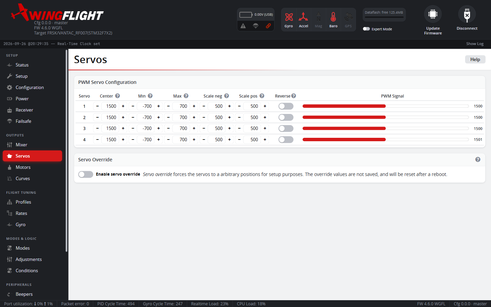
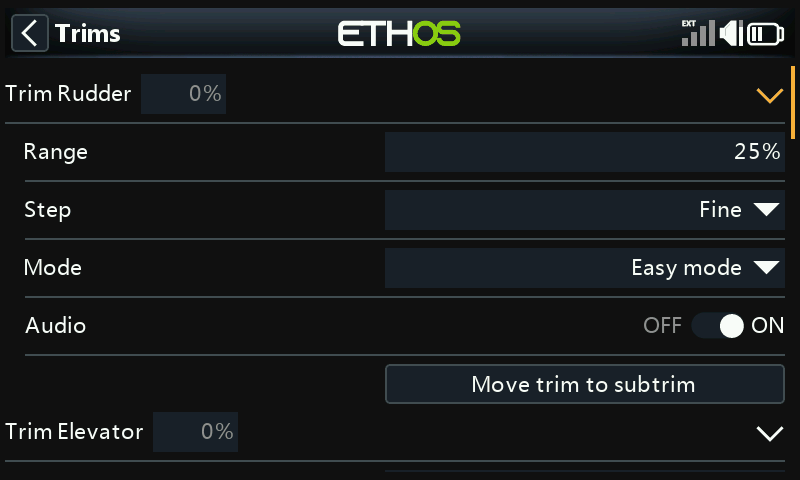
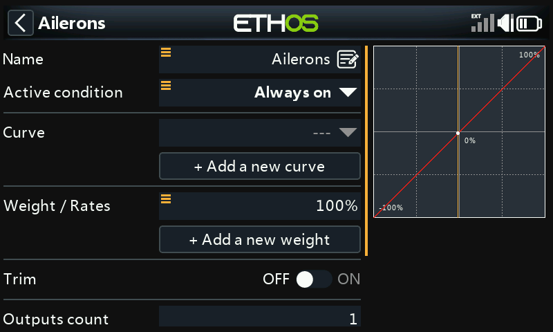
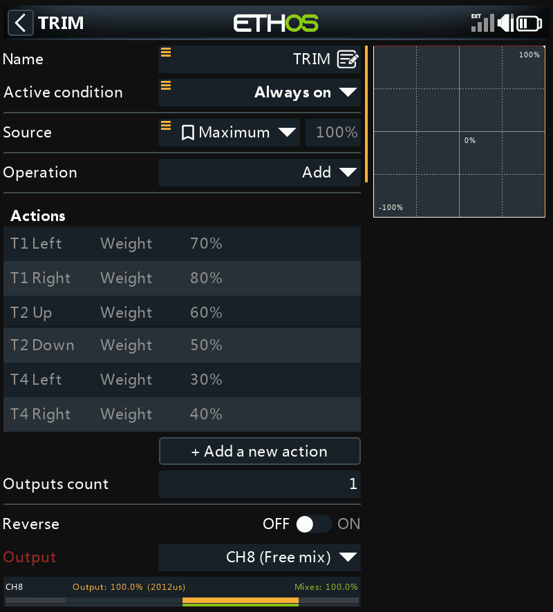

# Servos

The Servos tab configures each physical servo output: center point, travel
limits/endpoints, and direction (reversing), on top of whatever mixing rules
send input to that output.

Set servo endpoints conservatively at first -- it's easier to increase travel
once you've confirmed nothing binds mechanically at the extremes than to
diagnose a stalled/straining servo after the fact.

## Endpoints and scale

**Min**/**Max** cap the servo's actual pulse-width travel, to keep the arm
off a mechanical stop at either extreme. **Scale Neg**/**Scale Pos** are a
separate pair of per-side scaling factors (500μs default for a normal
1520μs-center servo, 250μs for a narrow-band 760μs-center one) -- adjust
these instead of Min/Max specifically to correct a servo that throws
noticeably further on one side than the other.

## Rate, Speed, and Reverse

**Rate** is the PWM update frequency for this output -- 50Hz for analog
servos (higher can damage them), 100-560Hz for digital servos depending on
what the datasheet supports. The default is 50Hz, the safe choice for any
servo; raise it only once you've confirmed your servos support it. It only takes effect after **Save and
reboot**, since the rate is set up at boot time, not applied live like most
other fields here.

**Speed** limits how fast the servo is allowed to move, expressed as
milliseconds needed for a 60° rotation -- 0 means unlimited. Useful for
deliberately slowing a specific output (e.g. retracts) independent of the
[Mixer](mixer.md) rule's own Speed limit on the same output.

**Reverse** flips direction if a surface moves the wrong way -- check
[Mixer](mixer.md) rule polarity first if only one of several surfaces on
the same axis is backwards, since Reverse here and a rule's own Reverse
checkbox both flip the same thing from different places.

## Balance Curve

When two servos drive the same surface (dual ailerons, split flaps) and
don't quite track each other, a per-servo **balance curve** trims one
servo's travel to match its partner. Balance curves are edited on the
[Curves](curves.md#servo-balance-curves) tab, not here. Any servo with a
non-flat curve shows a curve icon in its row; click it to jump straight to
that servo's curve. A bus servo that is cloning a PWM output (see
[below](#clone-pwm-outputs-to-bus-servos)) shows its source PWM servo's
curve, since that's the one actually shaping its output.

!!! note
    The **Geometry Correction** switch that older Configurator versions
    showed on this tab has been removed from the Configurator, so the
    correction can no longer be turned on or off from here.

## Trim

Trim never changes a servo's **Mid**. Each servo has a separate **Trim**
value in µs, added to its output on top of Mid. Mid and the Min/Max end
stops you set on the bench stay where you put them, however much you trim.

The **Trim** column holds two kinds of trim:

- **Saved trim** -- set by a **Stepped** Servo Trim adjustment, by
  [Auto Trim](../../flight-modes/auto-trim.md), or by typing it in here. It
  is saved like any other setting (on disarm, or with **Save** on this tab).
- **Live trim** -- set by a **Mapped** Servo Trim adjustment (a knob). It
  follows the knob, is never saved, and starts from zero every time the
  flight controller boots.

Both together are limited to 20% of the servo's Scale (the larger of Scale
Neg and Scale Pos -- ±100 µs at the default 500 µs). The output also stays
inside the servo's Min/Max, so trim can never drive a surface past the end
stops you set.

How the column shows it:

- **No Servo Trim adjustment for this servo:** the saved trim, editable.
- **A Servo Trim adjustment covers this servo:** read-only, showing the trim
  in use (saved plus live), so it moves as you turn the knob or flick the
  switch. Hover over it to see the two parts. The switch or knob owns the
  value, so it can't be typed over here. A badge beside it shows the
  adjustment, highlighted while active with its channel, e.g. `R CH #9` for
  roll on channel 9.
- **A bus servo cloning a PWM output:** read-only, showing that PWM servo's
  trim (see [below](#clone-pwm-outputs-to-bus-servos)).

The **Signal** column's full-stick estimate allows for the saved trim: trim
uses up travel on one side and gives it back on the other.

### Clear trims and Move trims into Center

Above each table:

- **Clear trims** sets every saved trim in that table to 0.
- **Move trims into Center** adds each servo's saved trim to its Mid and
  sets the trim to 0. The servo doesn't move, but Min/Max are measured from
  Mid, so the end stops move with it. Use it once you've trimmed the model
  out and want the result to become the new center -- and check the end
  stops afterwards.

Both count as unsaved changes until you press **Save**. Cloned bus servos
are skipped.

### Trimming in flight

Map **Servo Trim Roll**, **Servo Trim Pitch** or **Servo Trim Yaw** on the
[Adjustments](adjustments.md) tab to trim from the transmitter:

- **Stepped** (a momentary switch): each press moves the saved trim by one
  **Step**. A quick tap counts. Hold the switch and it starts repeating after
  half a second. Only the first step of each press beeps. The trim is saved
  when you disarm.
- **Mapped** (a knob or channel position): sets the live trim directly,
  within the adjustment's range. It is never saved.

Trimming an axis moves every servo whose [Mixer](mixer.md) rule takes its
input from that stabilized axis, not just one output. Each servo's Reverse,
its rule's weight sign and the axis's Invert are taken into account, so two
ailerons trim in opposite directions correctly. Servos fed by a raw RC
channel, an override or a logic condition aren't touched -- the same rule
[Auto Trim](../../flight-modes/auto-trim.md) uses. When any servo on the
axis reaches its trim limit, the whole axis stops, so a pair of servos on
one surface never get pulled out of line.

Because a Mapped trim is never saved, a knob that is misread -- for example
a channel that isn't valid yet just after power-up -- can move a surface by
at most the trim limit and leaves nothing behind once the reading is right
again. The firmware also ignores a trim channel until the receiver link has
been continuously present for a full second (both at power-up and after a
brief link drop), so a channel that comes online later than the link itself
can't pull a servo off center in that gap.

Stepped trims work on the bench too: the Trim column follows each press,
and **Save** keeps the result.

### Trim buttons on one channel

The radio's own trim buttons can drive Stepped trims on a single spare
channel. The Setup Wizard's **Trim and gain** step sets this up (**Trim
buttons on one channel**) and checks each button. The steps below use
Ethos as the example; on other radios (EdgeTX, OpenTX, Jeti and so on) set
up the same mix and weights, with each trim button as the switch for its
mix line. By hand:

1. **Model → Trims**: leave the aileron, elevator and rudder trims enabled,
   with **Audio** on so each press clicks.

    

2. **Model → Mixes**: in the Ailerons, Elevator and Rudder mixes, turn
   **Trim** off. A trim left on a stick is read as stick input, which the
   stabilizer holds against.

    

3. Add a **Free mix** named TRIM: Always on, **Source** Maximum,
   **Operation** Add, **Output** a spare channel. Add an action per trim
   button, setting the mix weight:

    | Trim button | Weight | Channel | Adjustment |
    |---|---|---|---|
    | T1 Right (aileron) | 80% | 1885-1935 µs | Servo Trim Roll, up |
    | T1 Left | 70% | 1835-1885 µs | Servo Trim Roll, down |
    | T2 Up (elevator) | 60% | 1780-1835 µs | Servo Trim Pitch, down |
    | T2 Down | 50% | 1730-1780 µs | Servo Trim Pitch, up |
    | T4 Right (rudder) | 40% | 1680-1730 µs | Servo Trim Yaw, up |
    | T4 Left | 30% | 1630-1680 µs | Servo Trim Yaw, down |

    

4. On the [Adjustments](adjustments.md) tab, add Servo Trim Roll, Pitch
   and Yaw as **Stepped**, always on, all on that channel, with the
   channel windows above and a Step of 2 µs.

Each weight puts its own value on the channel (100% is 2012 µs), and the
windows sit half-way between neighbouring buttons. With no button pressed,
the channel reads outside all of them.

!!! note "Upgrading from older firmware"
    Older firmware wrote Stepped trims and Auto Trim straight into Mid.
    Anything trimmed that way stays in Mid after the upgrade, and the new
    saved trims start at 0. In the CLI, `servo trim` lists the saved trims
    and `servo trim <servo> <µs>` sets one; `diff` and `dump` include them.

## Bus Servos

Enabling **SBUS Output** or **FBUS Master** on a serial port (see
[Configuration](configuration.md)) adds a second "Bus Servo Configuration"
table below the PWM one -- for digital bus servos wired to that UART instead
of individual PWM wires. The table lists as many bus servos as the output's
channel count (see [Bus output channel count](#bus-output-channel-count)).
Each bus output has the same Min/Max/Scale/Speed/Reverse fields as a PWM
servo, above. Bus servo N is channel N on the bus.

### Bus output channel count

How many channels each bus output sends is set with **F.Bus output channels**
and **SBUS output channels**, below the clone switch in the Bus Servo
Configuration section. Each appears only when a port has that output
assigned. A change applies straight away, the table resizes to match, and it
is saved with the rest of this tab. The CLI settings are
`fbus_master_channels` and `sbus_out_channels`:

| Output | Channel counts | Default | Frame |
|---|---|---|---|
| F.Bus | 8, 12, 16, 24 | 24 | 8 uses the 8-channel frame, 12 and 16 the 16-channel frame, 24 the 24-channel frame |
| SBUS | 8, 12, 16 | 16 | Always the 16-channel SBUS frame |

Channels past the count are sent at center. Pick 16 or less for F.Bus if
anything on the bus only accepts the 16-channel frame.

SBUS and F.Bus output can run at the same time, each with its own count. Bus
servo N is channel N on both, and the table lists the larger of the two
counts.

With a count of 16, channels 17 and 18 are also sent as on/off channels: on
when that bus servo's output is at 1500 µs or above. They aren't listed in
the table. The 24-channel F.Bus frame has no on/off channels.

With a 24-channel F.Bus receiver, receiver channels 19-24 are available too
(see [Receiver](receiver.md#channel-assignment)), so they can be mixed
straight to bus servos 19-24.

### Clone PWM outputs to bus servos

**Clone PWM outputs to bus servos** is **ON** by default: bus channel 1
mirrors PWM servo 1's final output, bus channel 2 mirrors PWM servo 2, and
so on for every bus channel that has a PWM counterpart. This means any
mixer built for PWM outputs -- including one generated by the [Mixer
Setup Wizard](mixer.md) for a named model type -- drives the bus servos
too, without needing separate mixer rules for them. Bus channels beyond
your PWM output count (e.g. channel 9 on a board with 8 PWM outputs)
always run their own independent mixer rule regardless of this setting,
since there's no PWM output to mirror. A cloned bus channel sends its PWM servo's output with that servo's
trim already in it, so its own Trim isn't used: the Trim column shows the
PWM servo's trim, read-only.

Turn it **OFF** for a custom model where the bus servos need mixer rules
of their own, distinct from the PWM outputs -- for example a different
control-surface layout on the bus side, or extra bus channels that don't
correspond 1:1 with your PWM outputs. With cloning off, a bus channel's
Min/Max/Mid/Trim/Scale/Speed/Reverse here and its own rule on the
[Mixer](mixer.md) tab (output numbers past your PWM count) take full
effect, exactly like a PWM servo does.

!!! note
    Turning this off doesn't change your existing PWM mixer rules -- it
    only changes whether the bus outputs *also* follow them. A common
    workflow is still to start from the Mixer Setup Wizard for the PWM
    side, then add or edit rules targeting the bus outputs on the
    [Mixer](mixer.md) tab afterward.
