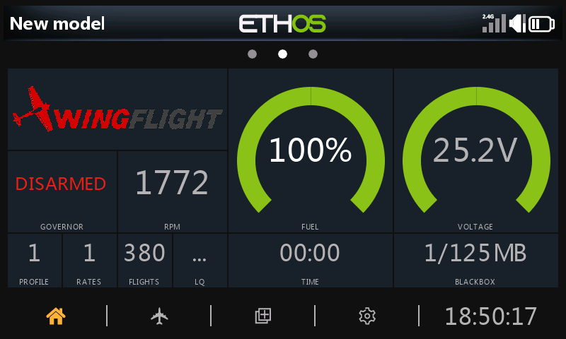
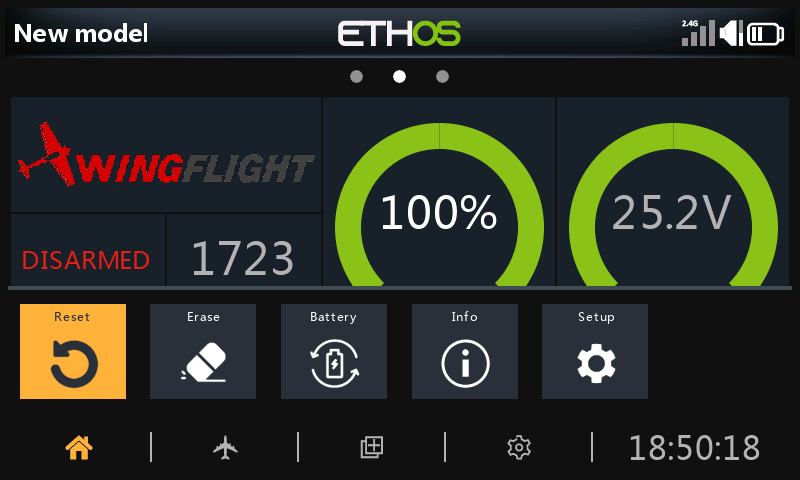
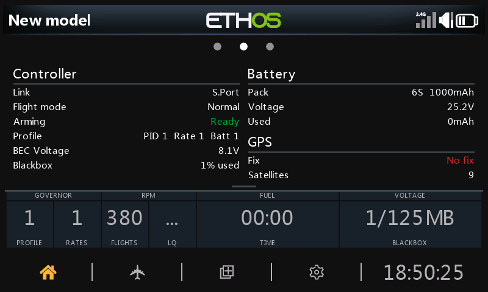

# Dashboard

The suite includes a dashboard widget for the model's home screen. It shows
the state of the model at a glance, and changes its layout for before,
during and after a flight.

## Adding it to a screen

The widget is called **Wingflight Dashboard**. On the radio, press **DISP**
to configure the model's screens, pick a full-screen layout for the screen
you want, and choose **Wingflight Dashboard** as its widget.

## Themes

A theme decides what the dashboard shows and how. Each theme has three
layouts: *preflight* before you arm, *inflight* while you fly, and
*postflight* after you land, and the dashboard switches between them by
itself.

Choose the theme under [Settings → Dashboard](settings.md#dashboard): a
default for all models, and optionally a different one for a particular
model. Some themes have options of their own, under **Settings** on the same
menu.

[Dashboard Themes](dashboard-themes.md) shows each theme's three layouts.

## Toolbar

Swipe up on the dashboard, or long-press **PAGE**, to open the toolbar. It
closes by itself after 10 seconds, or swipe down.

| Button | What it does |
| --- | --- |
| Reset | Resets the flight's timers and minimum and maximum values, after asking. |
| Erase | Erases the flight controller's blackbox log memory, after asking. Greyed out until the model is connected. |
| Battery | Picks the battery profile. Greyed out until the model is connected, or if fewer than two battery profiles are set up. |
| Info | Opens the info panel (below). |
| Setup | Opens the WingFlight app. Needs Ethos 26.1 or later. |

## Info panel

Swipe down on the dashboard, or pick **Info** on the toolbar, for a summary
of the model's state. It stays open until you swipe up, tap the dashboard,
press **RTN** or **ENTER**, or arm the model.

| | Shows |
| --- | --- |
| **Controller** | The telemetry link and its quality, the flight mode, whether the model is ready to arm (and if not, why), the active profiles, BEC voltage and how full the blackbox is. |
| **Battery** | The active battery profile's cells and capacity, the pack voltage and the mAh used. |
| **GPS** | Only when the model has a GPS: the fix (*No fix*, *Fix* or *Home set*) and the satellite count. |

A row appears once its value is known. With no model connected, both columns
say *Not connected*.

The dashboard's alert banner and the spoken callouts are covered in
[Radio Callouts and Alerts](../reference/radio-alerts.md).
