# Flight Tuning

**Flight Tuning** holds the settings you change most at the field: PIDs,
rates and how the model feels. The pages are the same settings as the
Configurator's, so each section below links to the Configurator page that
explains them.

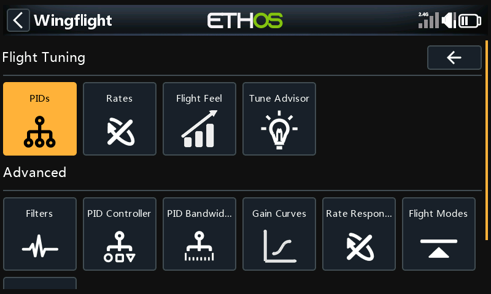

The menu scrolls: below **Advanced** there is a third row with **Thrust
Vector**.

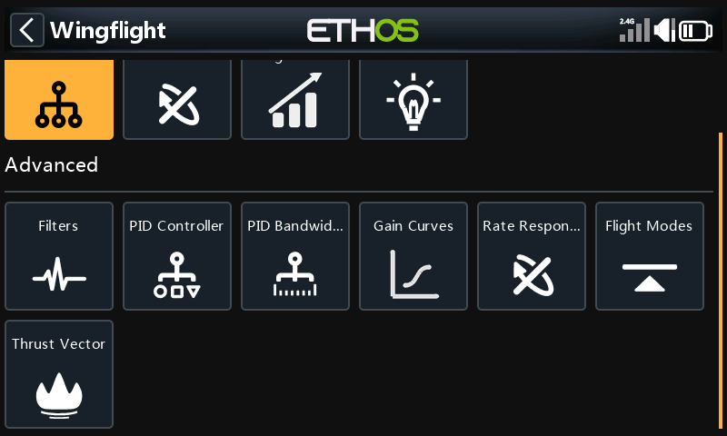

Most of these pages belong to a PID profile, shown in the title as
*PIDs #1* and so on. To work on another profile, switch to it (from the radio,
or with [Select Profile](tools-and-logs.md#select-profile)) and the page
follows.

## PIDs

P, I, D, F and B for roll, pitch and yaw.

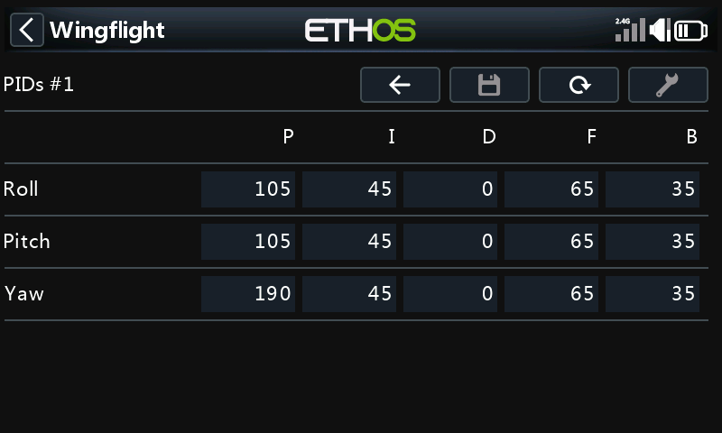

See [Profiles: PID Gains](../configurator/tabs/profiles.md#pid-gains).

## Rates

RC Rate, Rate and RC Expo for each axis, for the active rate profile (the
title shows its number).

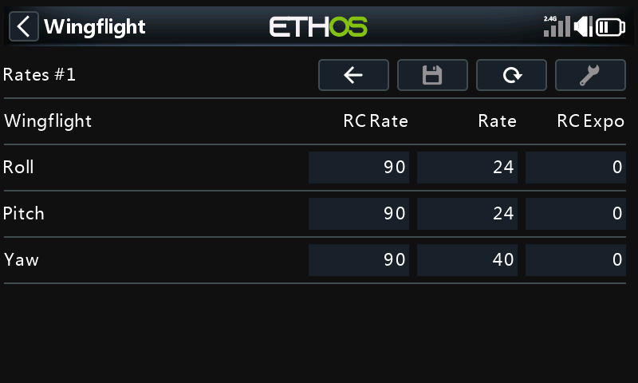

See [Rates](../configurator/tabs/rates.md#rate-shape-and-expo).

## Flight Feel

Gain, Decay and Relax per axis, plus the overall Throttle and Speed gains.

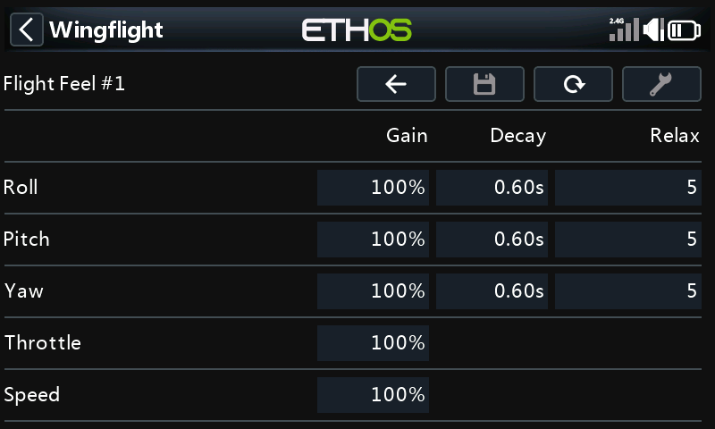

See [Profiles: Flight Feel](../configurator/tabs/profiles.md#flight-feel).

## Tune Advisor

Unlike the other pages, the Tune Advisor is the radio's own. While you fly in
rate mode, the flight controller measures how the model answers the sticks,
and each time you disarm the radio stores that flight's results. Pick an axis
to see how it responds and stops, and what the advisor suggests changing and
why. **Save** writes the suggested changes for that axis to the flight
controller; **Tool** clears the data it has collected.

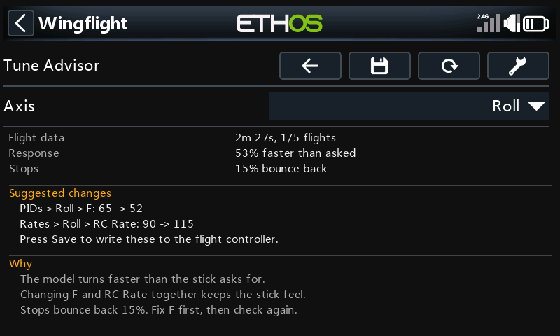

See [Tune Advisor](tune-advisor.md) for how flights are collected and
combined, what each suggestion means, what **Save** checks before it writes,
and how in-flight adjustments affect it.

## Filters

The gyro lowpass filters (type, cutoff, and dynamic range) and the notch
filters. The page scrolls.

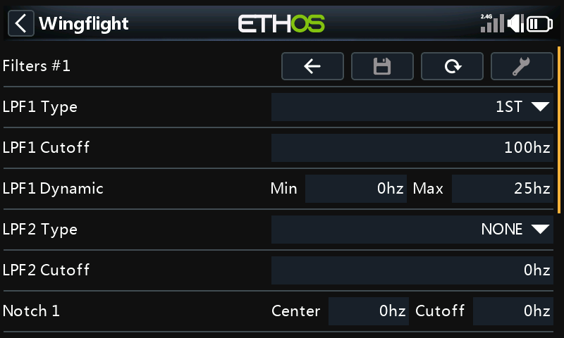

See [Gyro](../configurator/tabs/gyro.md).

## PID Controller

How the PID loop handles error: in-flight error decay, error limits, I-term
relax, and the [Cross-Axis Relax](../flight-modes/cross-axis-relax.md) and
[Snap Relax](../flight-modes/snap-relax.md) settings. The page scrolls.

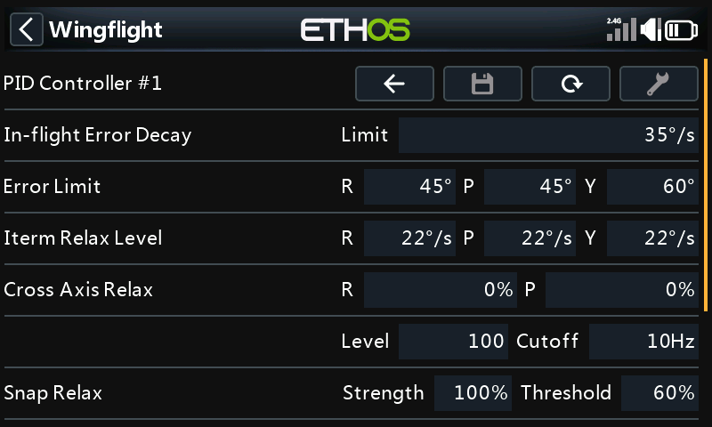

See also [Profiles: I-Term Relax](../configurator/tabs/profiles.md#i-term-relax).

## PID Bandwidth

Cutoff frequencies for the gyro, D-term and B-term, per axis.

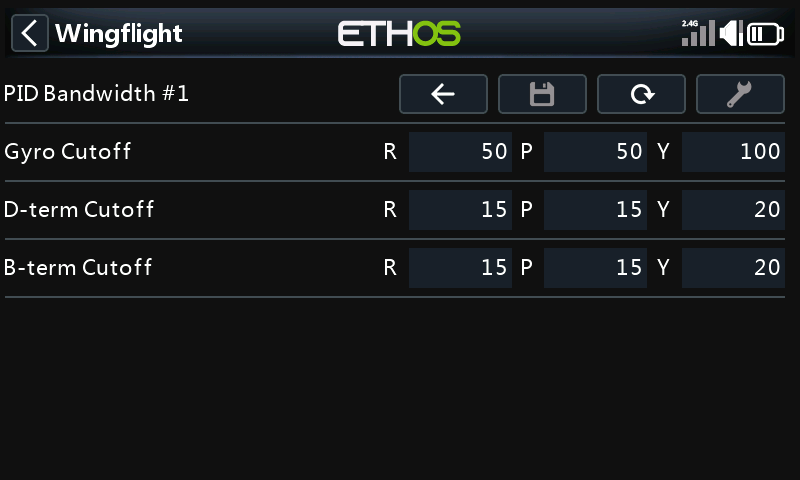

## Gain Curves

A gain curve for roll, pitch, yaw, throttle and speed, and the speed range
the speed curve covers.

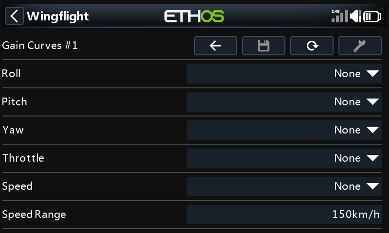

See [Profiles: Gain Curves](../configurator/tabs/profiles.md#gain-curves).

## Rate Response

How quickly the model follows the sticks: response time, acceleration limit,
setpoint boost and its cutoff for each axis, and the dynamic ceiling gain.

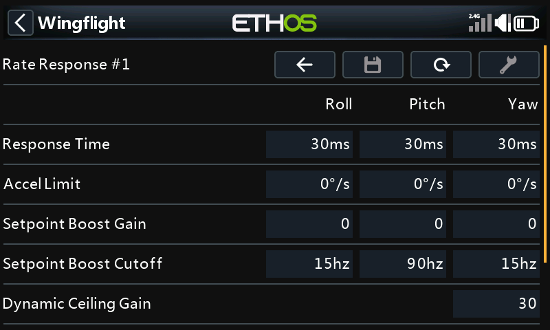

See [Rates: Dynamics](../configurator/tabs/rates.md#dynamics-expert-mode).

## Flight Modes

The self-levelling modes, one page each.

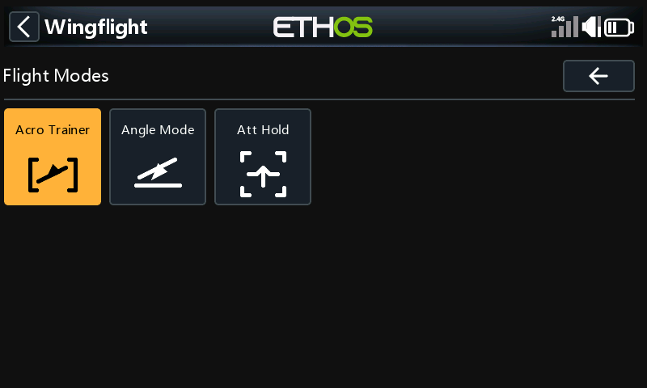

| Page | Settings | More |
| --- | --- | --- |
| Acro Trainer | Gain, and the bank and pitch limits | [Trainer Mode](../flight-modes/trainer.md) |
| Angle Mode | Gain, damping, and the bank and pitch limits | [Profiles: Flight-mode settings](../configurator/tabs/profiles.md#flight-mode-settings) |
| Att Hold | Gain, deadband and rate | [Attitude Hold](../flight-modes/atthold.md) |

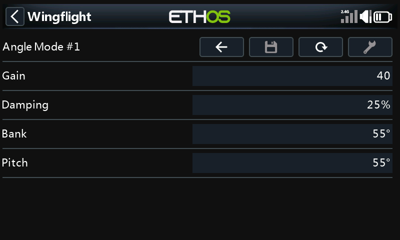

## Thrust Vector

For models with thrust vectoring: the same tuning pages again, for the thrust
vector profile, plus **Att/Hdg Hold**.

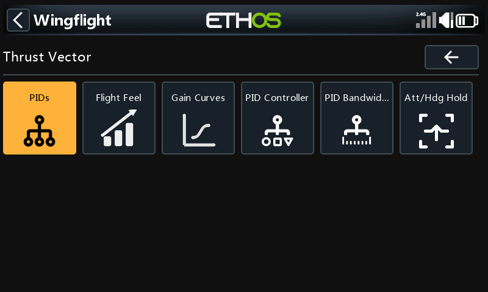

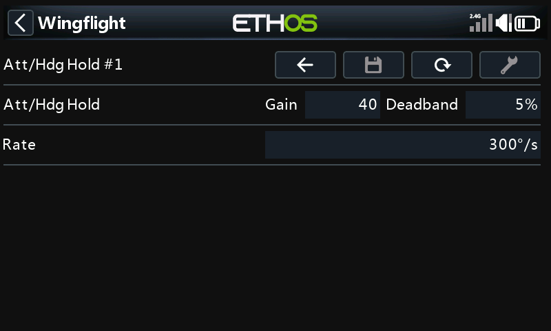

See [Thrust Vector](../configurator/tabs/thrust-vector.md) and
[Thrust Vector Attitude Hold](../flight-modes/tv-hold.md).
