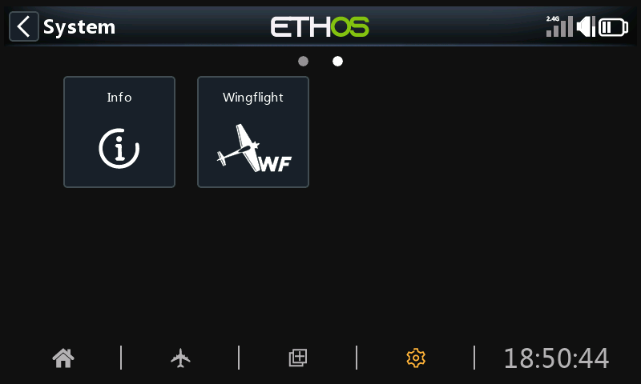

# Installing the Lua Suite

## 1. Download

Download the suite from the
[releases page](https://github.com/WingFlight/wingflight-lua-ethos-suite/releases).
Each release has one zip per language, for example
`wingflight-lua-ethos-suite-0.0.34-en.zip` for English. Pick the release that
matches your firmware version: the release notes say which firmware it is
for.

## 2. Put it on the radio

Use either way:

- **Ethos Suite:** connect the radio by USB, open *Lua Development Tools*,
  choose *Install Lua Scripts*, and select the zip.
- **By hand:** connect the radio by USB as a drive, unzip the download, and
  copy the `wfsuite` folder into the `scripts` folder on the radio. Replace
  the old `wfsuite` folder if there is one.

Then unplug the radio and restart it.

## 3. Turn on the background task for your model

The suite does its work in a background task that each model has to turn on.
On the radio, open the **Model** menu, go to page 3, and open **Lua**. Turn
**Wingflight [Background]** on.

![Model menu, Lua page, with Wingflight [Background] turned on](../assets/images/ethos-suite/model-lua-task.png)

Until it is on, every tile in the app shows *Background task not running*
when you press it.

## 4. Check telemetry

The app talks to the flight controller over telemetry, so the radio needs a
working link to the receiver:

1. In the **Model** menu, **RF system**, make sure the RF module you fly with
   is turned on.
2. Power up the model, then open **Model** → **Telemetry** and discover
   sensors if the list is empty.

If sensors are missing, see [Telemetry](../reference/telemetry.md) for the
flight controller side.

## 5. Open the app

Press **SYS** on the radio and go to the second page. The **Wingflight** tile
opens the app.

With the model powered and connected, every tile in the app can be opened.
Without a connection, only **Logs** and **Settings** work: everything else
needs the flight controller. Continue with [Using the app](using-the-app.md).

## Updating

Install a new release the same way. Your app settings (under **Settings**)
are kept in a separate folder, `scripts/wfsuite.user`, so replacing the
`wfsuite` folder does not lose them.
