# Settings

**Settings** are the suite's own options. They are stored on the radio, not
on the flight controller, so this menu works with the model switched off.
Saving here asks *Save current page to flight controller?* like every other
page, but the settings go to the radio.

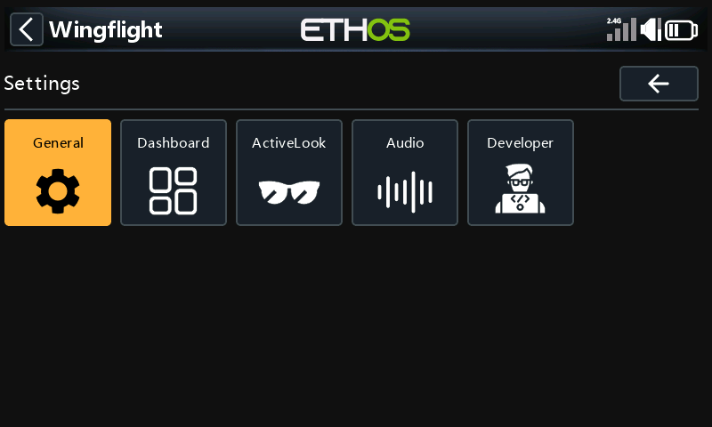

## General

Grouped into panels; tap a panel to open it.

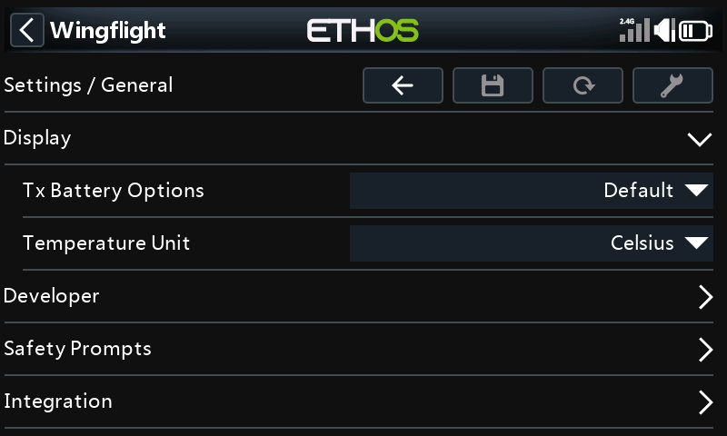

| Panel | Settings |
| --- | --- |
| Display | How the radio's own battery is shown (*Tx Battery Options*), and the temperature unit. |
| Developer | *Developer mode*, which adds a Developer menu under **Tools**. You won't need it for flying. |
| Safety Prompts | *Save confirm* and *Reload confirm*: turn off to save or reload without being asked. |
| Integration | *Sync model name*: while the model is connected, the radio shows the flight controller's craft name as the model name, and puts the old name back afterwards. *Battery profile on connect*: asks which battery is fitted each time the model connects. |

## Dashboard

Choose and set up the [dashboard](dashboard.md) theme.

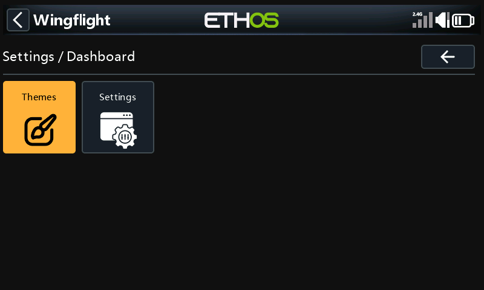

- **Themes:** the default theme for all models, and optionally a different
  theme for this model.
- **Settings:** one tile per theme, for the options that theme has.

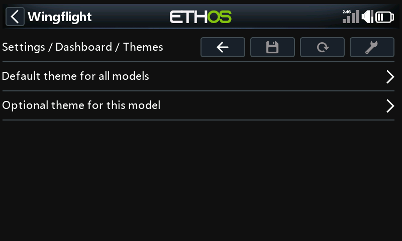

## ActiveLook

For ActiveLook glasses: what the glasses show before, during and after a
flight. **Settings** turns the glasses display on and sets its position; the
other three pages each pick a layout and what goes in each slot.

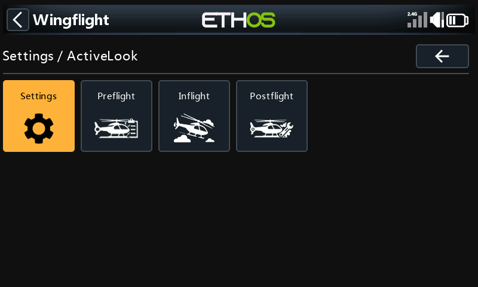

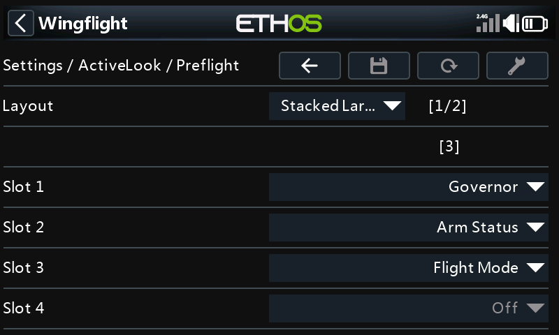

## Audio

What the radio says, and when.

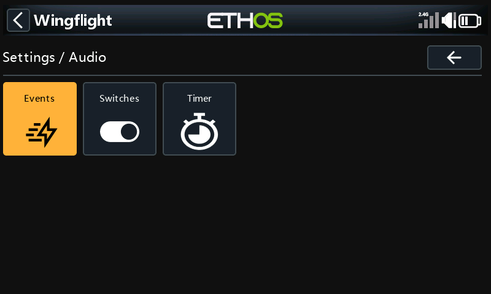

### Events

Callouts and alerts, one page per kind:

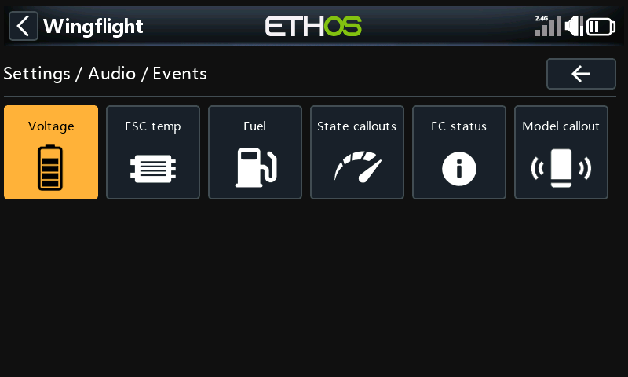

| Page | What it covers |
| --- | --- |
| Voltage | Low battery voltage, and BEC and receiver voltage alerts, with their thresholds. |
| ESC temp | An alert when the ESC gets hotter than a threshold. |
| Fuel | Fuel (charge left) callouts, and the low-fuel warning. |
| State callouts | Arming, flight mode, GPS fix, and PID and rate profile changes. |
| FC status | Alerts from the flight controller, such as the backup receiver taking over or the GPS not responding. |
| Model callout | Plays the model's name when it connects, if you have recorded it. |

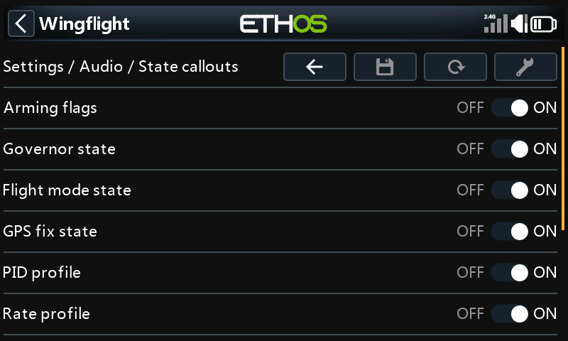

See [Radio Callouts and Alerts](../reference/radio-alerts.md) for what each
alert means and what to do about it.

### Switches

Pick a switch for a value, and the radio reads that value aloud when you flip
it: altitude, voltages, consumption, current, ESC temperature, RPM and more.

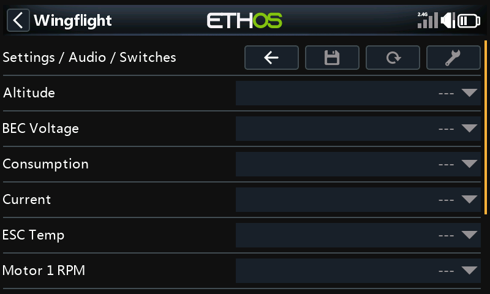

### Timer

Callouts for the flight timer: when it runs out, and alerts before and after.

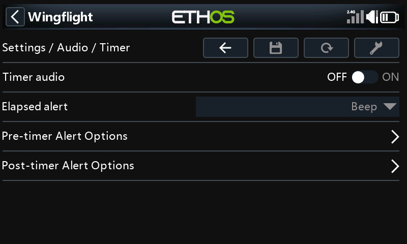
