# Setup

**Setup** covers how the model is built and wired: the board and radio, the
sensors, the mixer and servos, and power and motors. Each section links to
the Configurator page that explains the settings.

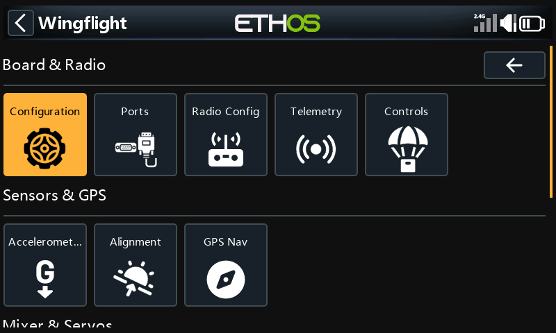

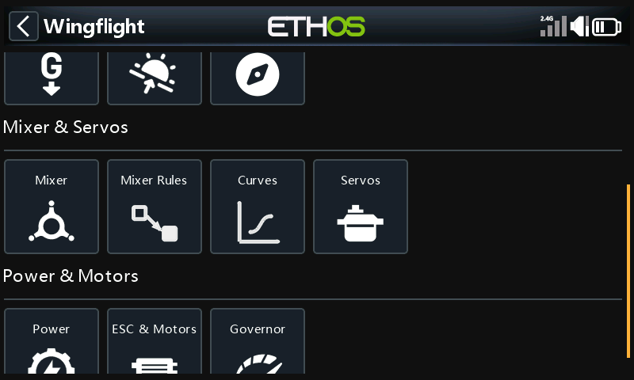

## Board & Radio

### Configuration

The craft name, PID loop speed, and the features the board runs: GPS, LED
strip, thrust vectoring and the ready-to-arm wiggle.

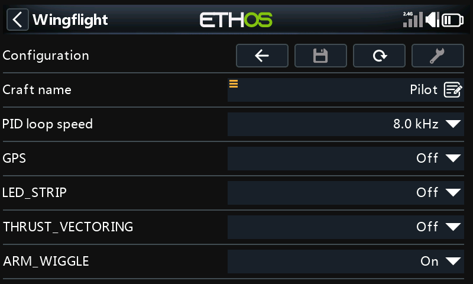

See [Configuration](../configurator/tabs/configuration.md) and
[Ready-to-Arm Wiggle](../flight-modes/ready-to-arm-wiggle.md).

### Ports

What each UART is used for, and its speed.

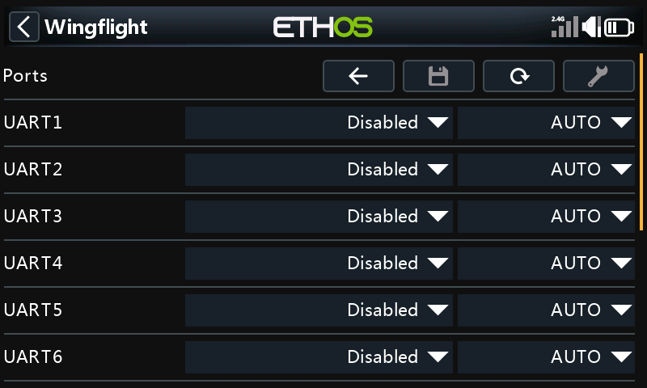

See [Serial Ports](../reference/serial-ports.md).

### Radio Config

Stick deflection and centre, the throttle range, and the deadbands.

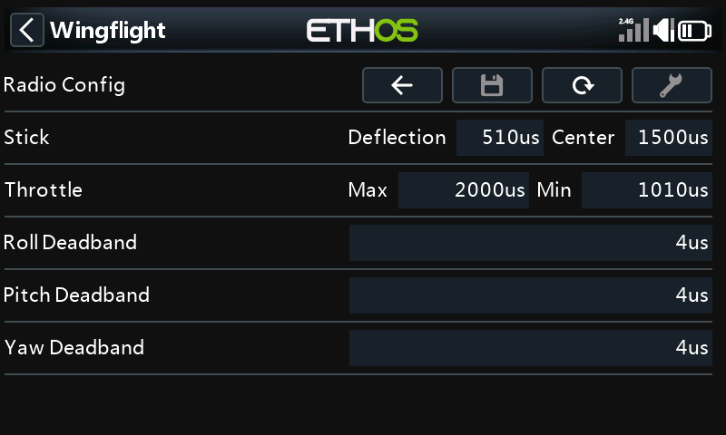

See [Receiver](../configurator/tabs/receiver.md#channel-range).

### Telemetry

The telemetry sensors the flight controller sends, grouped by kind. Open a
group to turn sensors on or off. **Tool** selects the default sensors.

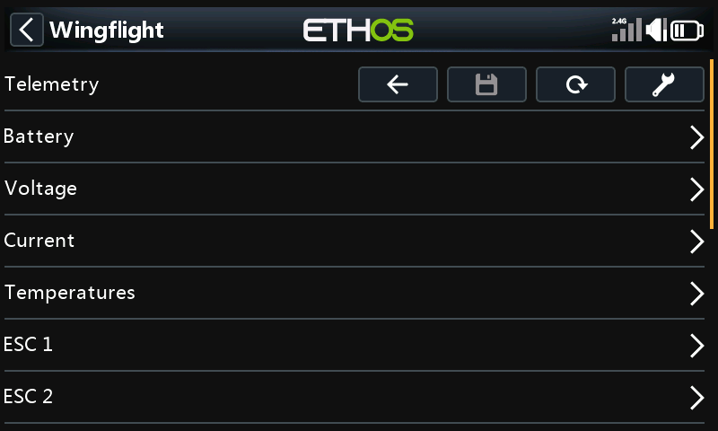

See [Receiver: Telemetry Sensors](../configurator/tabs/receiver.md#telemetry-sensors)
and [Telemetry](../reference/telemetry.md).

### Controls

A menu of its own:

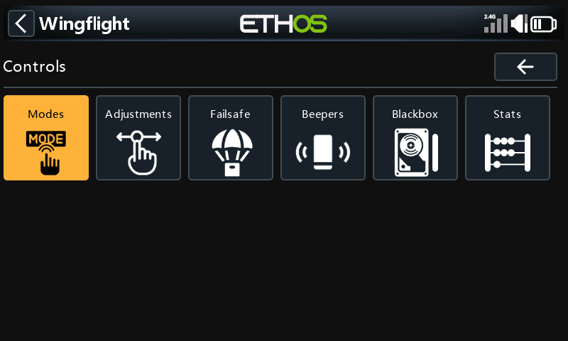

| Page | What it is for | More |
| --- | --- | --- |
| Modes | Switch ranges for each mode. Pick a mode, then add or change its ranges. | [Modes](../configurator/tabs/auxiliary.md) |
| Adjustments | In-flight adjustments from a switch or knob. | [Adjustments](../configurator/tabs/adjustments.md) |
| Failsafe | **Ch. Fallback**: what each channel does when the signal is lost. **Stage 2**: the failsafe procedure and its delays. | [Failsafe](../configurator/tabs/failsafe.md) |
| Beepers | Which events sound the beeper, and the ESC beacon. | [Beepers](../configurator/tabs/beepers.md) |
| Blackbox | The logging device, rate and fields, and the log memory's status. **Tool** on *Status* erases it. | [Blackbox](../configurator/tabs/blackbox.md) |
| Stats | Flight count, and last and total flight time. | |

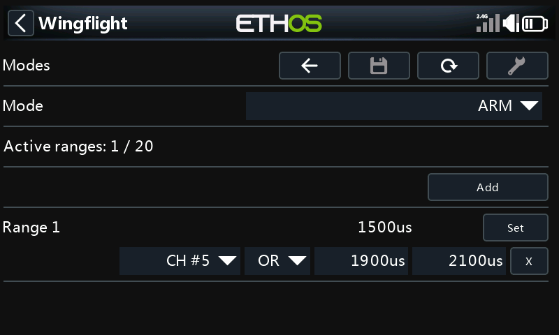

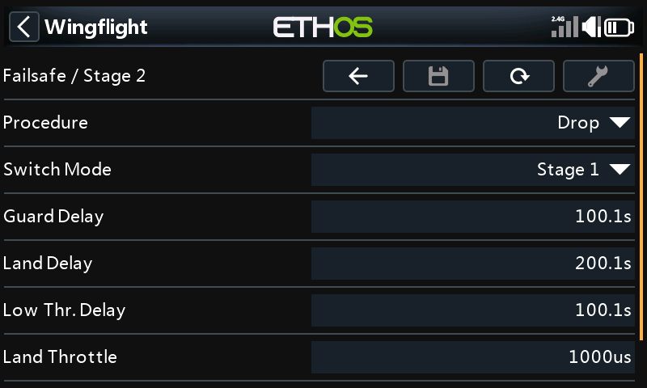

## Sensors & GPS

### Accelerometer

Accelerometer trim for roll and pitch. **Tool** calibrates the
accelerometer: keep the model level and still while it does.

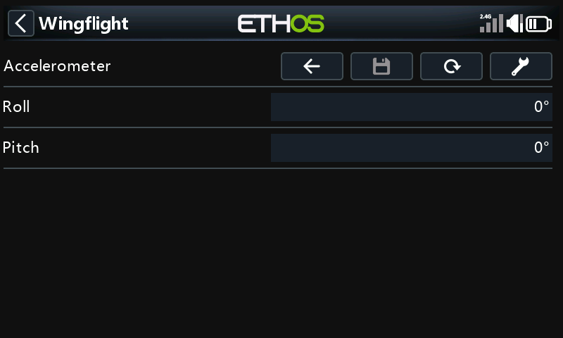

### Alignment

How the board is mounted, with a live 3D view of the model that follows the
board as you move it. **Tool** turns the view so the tail faces you.

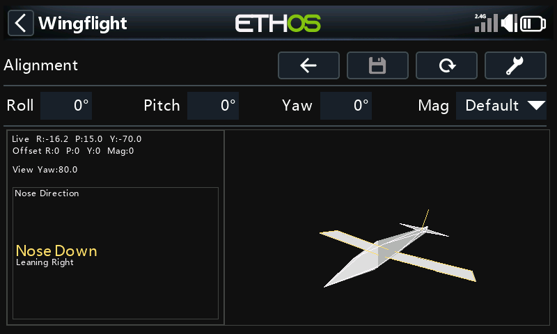

See [Configuration: Board Alignment](../configurator/tabs/configuration.md#board-alignment).

### GPS Nav

Return-to-home and loiter settings: whether the model can arm without a GPS
fix, RTH altitude, loiter radius and direction, minimum satellites, and the
bank and pitch limits. The page scrolls.

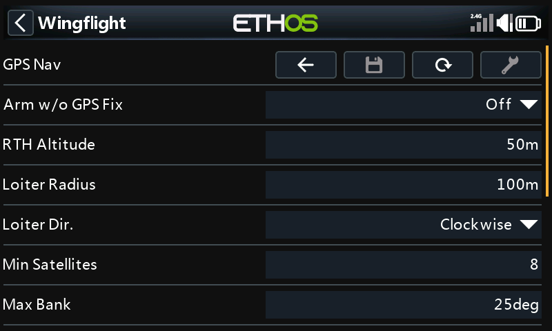

See [GPS Navigation](../configurator/tabs/gps-navigation.md) and
[GPS RTH and Loiter](../flight-modes/gps-rth.md).

## Mixer & Servos

### Mixer

Throw and direction for roll, pitch and yaw.

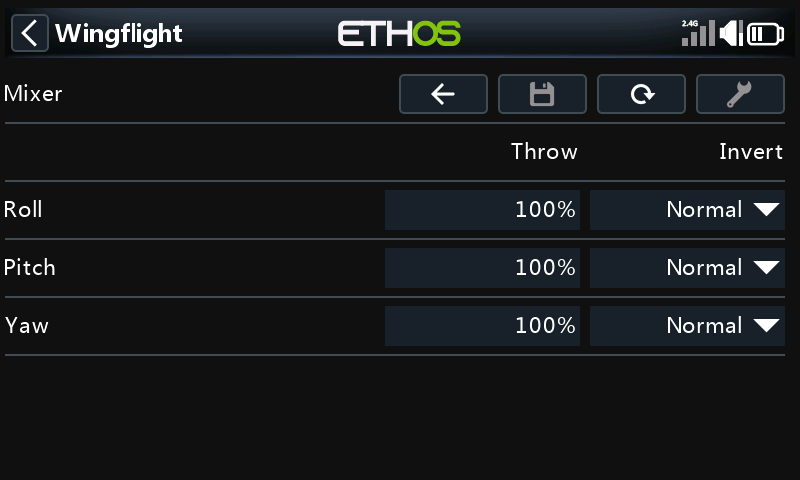

See [Mixer](../configurator/tabs/mixer.md).

### Mixer Rules

The mixer's rules, one row each. Select a rule to edit it.

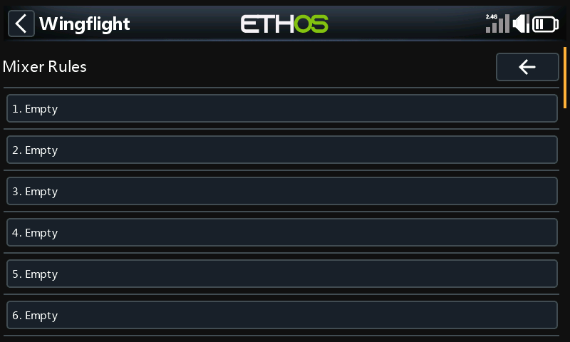

### Curves

Mixer, gain and servo curves.

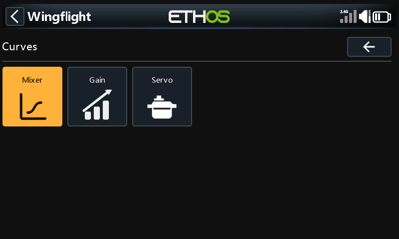

See [Curves](../configurator/tabs/curves.md).

### Servos

**PWM Output** lists the servos; select one to set its centre, limits and
direction. **BUS Output** is for bus servos and is greyed out unless the
model has them. **Tool** turns servo override on, so a servo moves to its
centre as you change it.

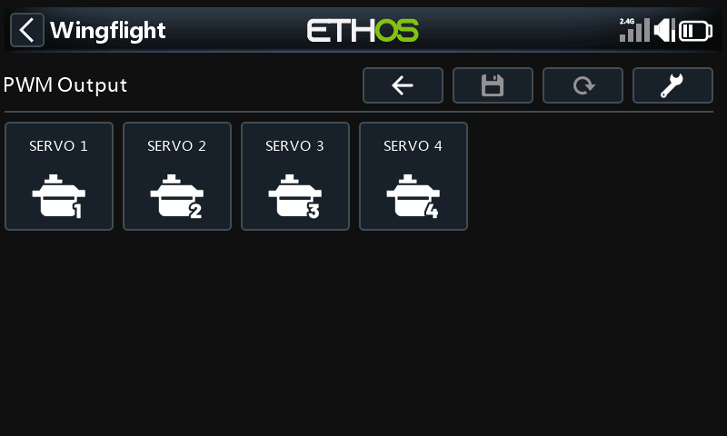

See [Servos](../configurator/tabs/servos.md).

## Power & Motors

### Power

| Page | What it is for |
| --- | --- |
| Battery | Battery profiles: capacity and cell voltages. |
| Alerts | Flight time alarm and the BEC and receiver voltage alerts. |
| Sources | Where voltage and current are measured. |
| SmartFuel | How fuel (charge left) is worked out. |

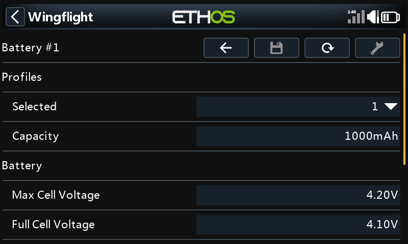

See [Power](../configurator/tabs/power.md).

### ESC & Motors

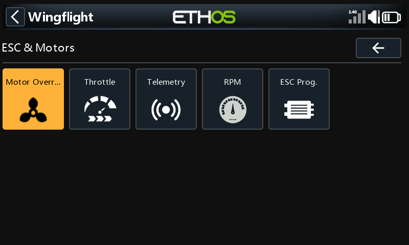

| Page | What it is for | More |
| --- | --- | --- |
| Motor Override | Run the motor from the radio, for testing. Take the propeller off and secure the model first. | |
| Throttle | Throttle protocol, update rate and PWM endpoints. | [Motors](../configurator/tabs/motors.md) |
| Telemetry | ESC telemetry protocol and corrections. | [Motors](../configurator/tabs/motors.md) |
| RPM | Where RPM comes from, motor ratios and pole count. | [Motors: RPM source](../configurator/tabs/motors.md#rpm-source) |
| ESC Prog. | Change your ESC's own settings from the radio, through the flight controller. Pick the ESC's make. | [ESC Programming](../configurator/tabs/esc-programming.md) |

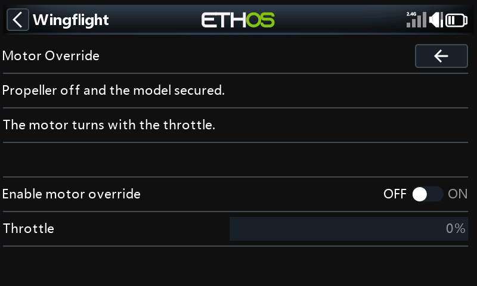

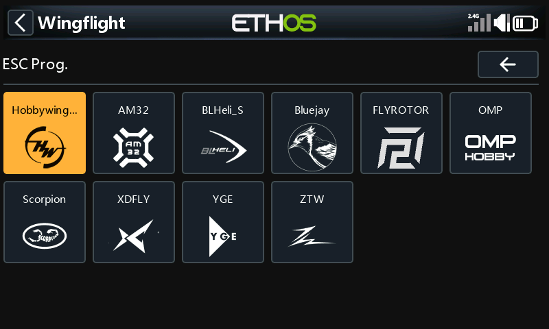

Each ESC page shows the ESC it found, then its settings in groups:

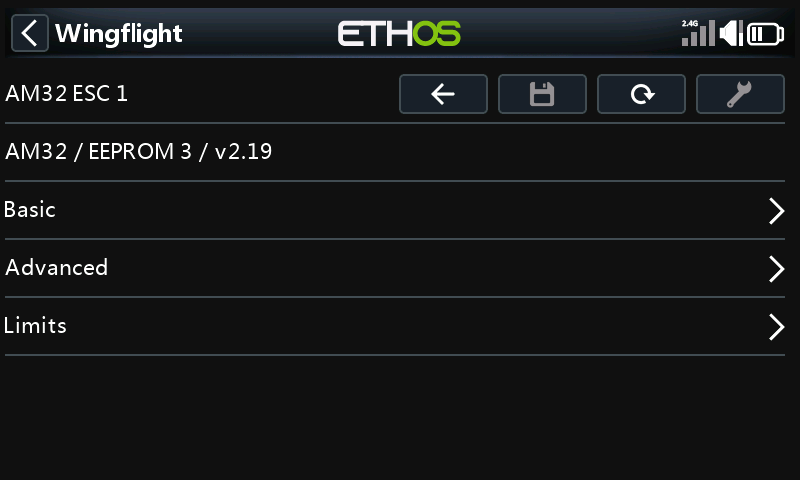

### Governor

The throttle range governor: its mode, then RPM, response and idle settings.

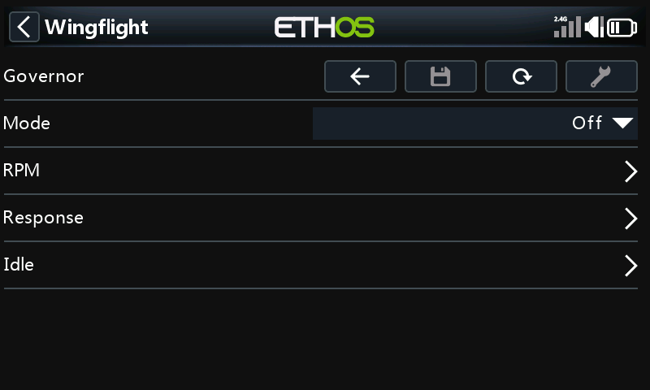

See [Governor](../flight-modes/governor.md).
