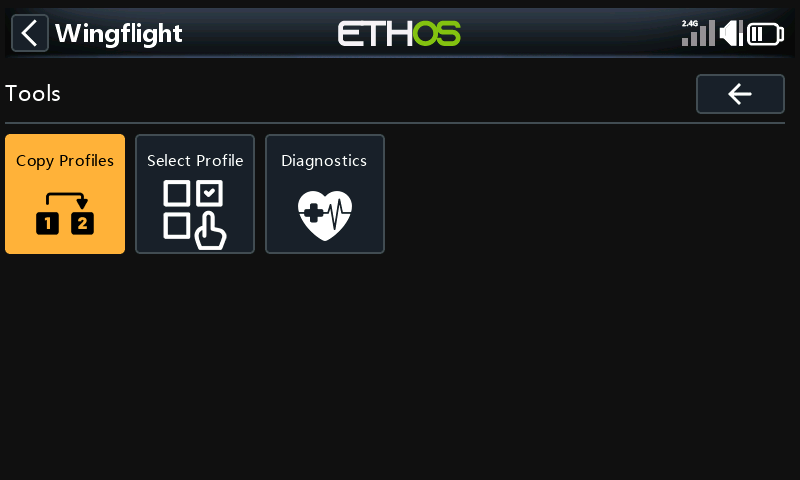
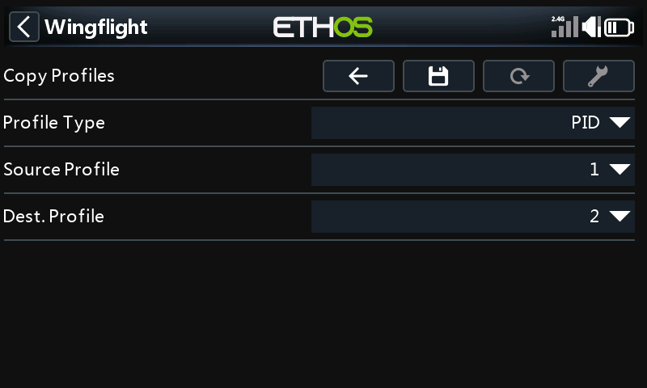
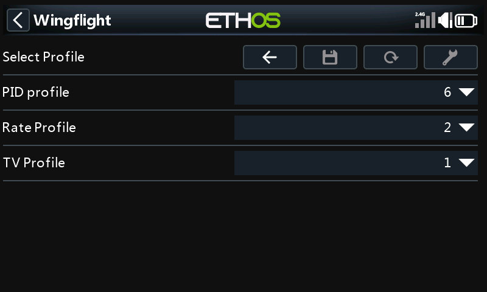
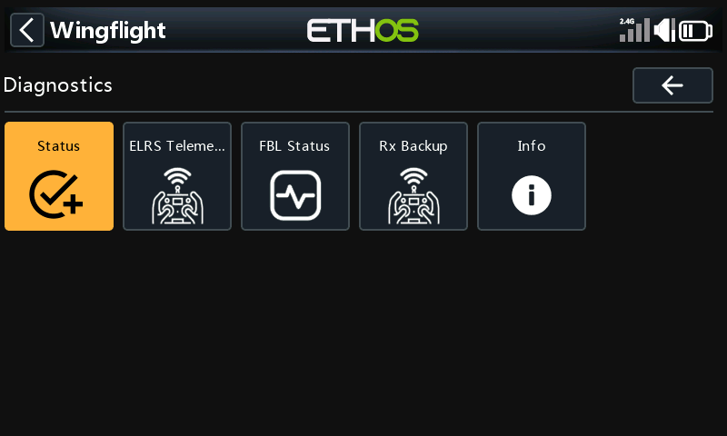
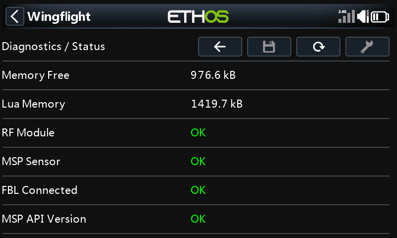
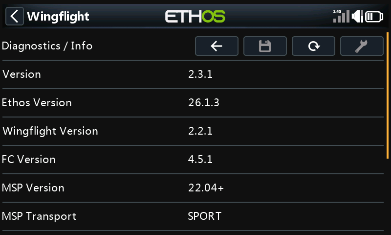
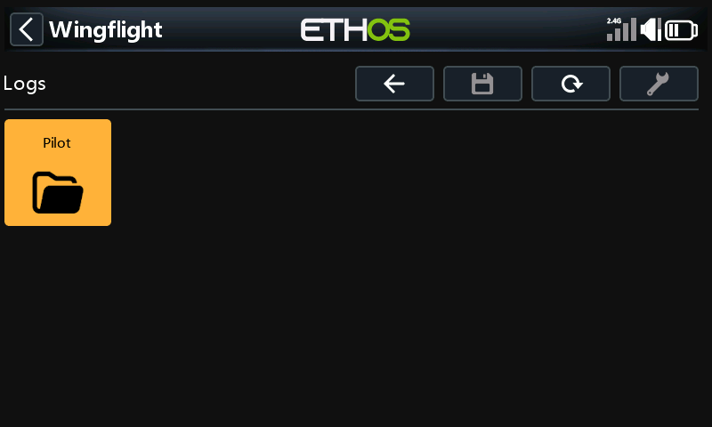
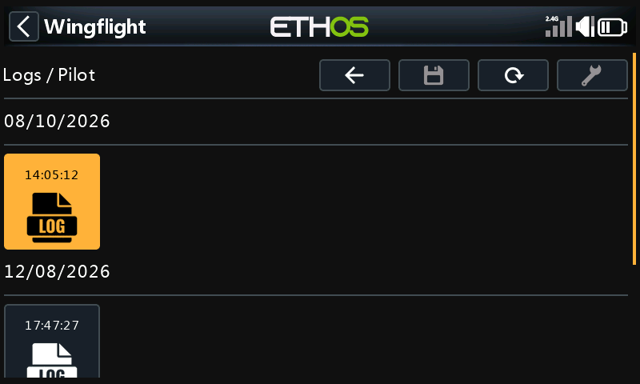
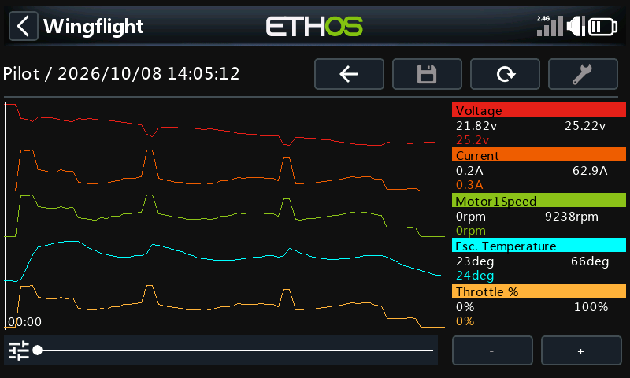

# Tools and Logs

## Tools

### Copy Profiles

Copies one PID or rate profile over another. Pick the profile type, the
source and the destination, then press **Save**.

### Select Profile

Switches the flight controller to another PID, rate or thrust vector profile.
The tuning pages follow the profile you pick.

### Diagnostics

Read-only pages for checking the link and the flight controller:

| Page | What it shows |
| --- | --- |
| Status | Whether the radio side is working: free memory, the RF module, the MSP sensor, the connection to the flight controller and the API version. |
| ELRS Telemetry | Probes the ExpressLRS module and its link. It needs CRSF telemetry. |
| FBL Status | The flight controller's arming flags, blackbox space, load, and active profiles. |
| Rx Backup | The [backup receiver](../flight-modes/backup-rx-input.md) input: protocol, link, which source is active, and its channels. |
| Info | Version numbers: the suite, Ethos, the firmware, and the MSP protocol. |

When something doesn't work, **Status** and **Info** are the first places to
look, and worth a screenshot when you ask for help.

## Logs

The radio logs telemetry while you fly: voltage, current, motor RPM, ESC
temperature and throttle. **Logs** works without the model connected.

Logs are kept per model, under the craft name:

Inside, flights are grouped by date, one tile per flight:

Open a flight to see it as a graph. The legend on the right shows each
value's minimum and maximum over the flight, and its value at the cursor.
Drag the slider to move through the flight. **-** and **+** zoom out and in;
they are greyed out when the whole flight already fits.

