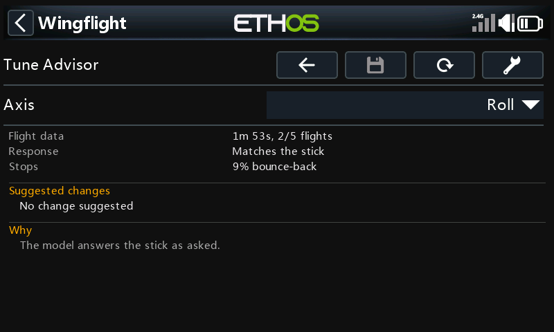
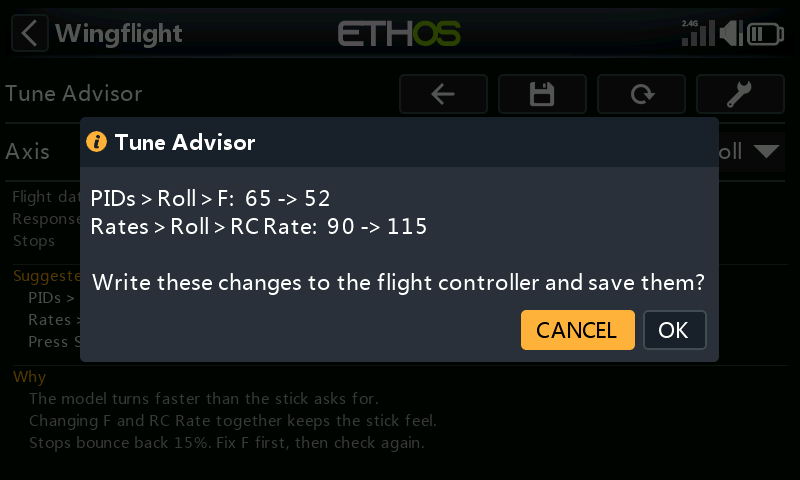

# Tune Advisor

The Tune Advisor tells you how your model answers the sticks and what to change next. While you fly in rate
mode, the flight controller measures each axis. Each time you disarm, the radio saves those measurements. The
page combines your last few flights and suggests one change at a time for each axis. **Save** can write that
change to the flight controller for you.

*Configuration* → *Flight Tuning* → *Tune Advisor*

The flight controller needs firmware with the Tune Advisor (built on boards with more than 128 KB of flash).
Older firmware shows *Needs newer firmware*. The radio's background task must be running, and the model must
have been connected since the page opened. After that, the saved flights stay on screen through a link loss.

## Collecting flight data

The flight controller counts only armed, airborne rate flight. Time in ANGLE, ATT HOLD, TRAINER, the GPS modes,
failsafe, MANUAL or PASSTHROUGH is left out.

What it needs:

- **Response** needs about ten seconds of stick inputs between 40 and 200 deg/s on that axis: rolls, pitch
  inputs, rudder inputs. *Needs more flying* shows how far along it is.
- **Stops** needs 10 stick releases: move the stick, then let it snap back to centre. Centre the stick after each
  input instead of reversing straight through.

One flight may be enough, or it may take a few. Fly your normal rate-mode flying with clear inputs and
releases on each axis. On a wing, rudder data is often too uneven to judge, and that is normal.

## How flights are saved and combined

Each time you disarm, the radio's background task reads the measurements for roll, pitch and yaw from the flight
controller. It saves them as one flight and then clears them on the flight controller, so the next flight is
measured on its own. This happens whether or not the Tune Advisor page is open.

- The flights are kept on the radio's SD card in `LOGS:/wfsuite/tune/<model>/history.csv`, one row per axis per
  flight. `<model>` is the flight controller's ID, the same one that names the flight log folders. A `logs.ini`
  beside it holds the model name.
- Only the **last 5 flights** are kept.
- A flight with no rate flight in it is not saved.
- If you disarm while the radio has lost the link, the flight is saved when it reconnects. That works as long as
  the flight controller has not been powered off in between: it keeps the numbers in memory until the radio
  reads them.

The page combines the flights like this:

1. It starts from the **newest** flight and works backwards, up to 5 flights.
2. It only combines flights flown on **the same tune** as the newest one: the same P, F, B, Relax and RC Rate on
   that axis. It stops at the first older flight with a different tune. Advice worked out from flights on an
   old tune would be advice for settings you no longer fly.
3. Counts add up: seconds of data, stick releases, full-stick moments.
4. Each measurement is averaged across the flights, weighted by how much data it came from. A long flight
   counts for more than a short one.

The flight controller weights its own response figure slightly differently inside a flight, so the combined
response is a close estimate rather than an exact one. The stop figures combine exactly.

Each axis is combined on its own. Changing roll does not throw away the pitch or yaw flights.

*Flight data* on the page shows how much was combined, for example *1m 53s, 2/5 flights*: 1 minute 53 seconds
of usable rate flight, from 2 of the 5 saved flights.

## Reading the page

| Line | What it shows |
| --- | --- |
| Axis | Roll, Pitch or Yaw. Everything below is for this axis. On 480-pixel-wide radios a *Changes / Why* selector sits beside it: *Changes* shows the suggestions and as many reasons as fit, *Why* shows all the reasons. |
| Flight data | How much rate flight was combined, and from how many of the last 5 flights. |
| Response | How fast the model turns compared with what the stick asks for, for example *53% faster than asked*. |
| Stops | How far the model bounces back after you centre the stick, as a share of the turn rate. |
| Suggested changes | Up to three changes, each named by the page and setting and in the units that page shows, for example *PIDs > Roll > F: 65 -> 52*. |
| Why | The reason for each change, and a fact worth knowing when there is room. |

## What it suggests

The flight controller only measures. The advice is worked out on the radio, so it can be improved without a
firmware update.

- **Turns faster or slower than asked** (more than 15% off): change F and RC Rate by the same amount in opposite
  directions. The stick still moves the surfaces as far as before, but now asks for the rate the model really
  flies. One step changes F by at most 20%, so you fly and check again rather than jump. F never goes below 50,
  the lowest F the firmware allows.
- **Full stick asks for more roll rate than the model reaches**, with the surfaces at their limit: lower RC Rate
  to what the model reaches, or add surface throw.
- **Stops bounce back 12% or more:**
  - If the I-term pushes the model back after the stop, raise *Flight Feel > Relax* by one.
  - If F does not match yet, fix F first and check again.
  - Otherwise the controller is barely braking the stop: raise P by 20% (or add B).
- **Turns faster at high throttle than at low** (or the reverse) by 25% or more is shown as a fact, with no change.

## Applying the changes

Press **Save** (the disk icon) to write the suggested changes for the axis on screen. It is greyed out unless
the model is connected and disarmed and there is a change to make. It applies **one axis at a time**: switch
*Axis* and press **Save** again for another axis.

**Save** first lists exactly what it will change and asks you to confirm (*Cancel* is selected). It then shows
each step as it runs:

1. **Reading current settings**: reads PIDs, Flight Feel and Rates from the flight controller. If a read fails,
   or a reply comes back short, it stops and nothing is changed.
2. It checks that the flight controller still holds the tune the flights were flown with: the same PID and rate
   profile, and the same P, F, B, Relax and RC Rate on that axis. If anything differs it stops, and nothing is
   changed. That happens if you changed a setting by hand, switched profile, or already applied this advice.
   It also stops if a new value is out of range or the model has been armed.
3. **Writing changes**: only the advised settings change. Everything else is written back exactly as it was read.
4. **Saving to flight controller**: makes the change permanent.
5. **Checking saved settings**: reads the settings back to confirm the new values.

When it has finished, the page shows *Changes saved to the flight controller* for that axis until the next flight
is saved.

| Message | What happened |
| --- | --- |
| Could not read the settings… | A read failed. Nothing was changed. |
| The settings on the flight controller are not the ones these flights were flown with… | The tune differs from the flights'. Nothing was changed. Fly again on the current settings. |
| Disarm first… | The model was armed. Nothing was saved. |
| Writing failed… | Part of the change may have been sent but none of it was saved. Restarting the flight controller undoes it. |
| Saving failed… | The change is active but not saved. It is undone when the flight controller restarts. |
| Saved, but reading back did not confirm it… | Check the values on *PIDs*, *Rates* and *Flight Feel*. |

### After applying

The saved flights are **not** erased. Your next flight is on the new tune, so the page starts again from it and
leaves the older flights out of the advice. The flight controller also starts its measurements afresh when it
arms on a changed tune. You do not need to press **Tool** to clear anything.

Every change **Save** writes is added to `changes.csv` beside the flight history: date, axis, setting, old value,
new value. It is your record of what the advisor changed, so you can always set a value back by hand on *PIDs*,
*Rates* or *Flight Feel*. **Tool** does not erase it.

## Adjustment functions

[Adjustments](../configurator/tabs/adjustments.md) let you change settings from a switch or knob while flying.
Several of them change exactly what the Tune Advisor measures and writes: P, F, RC Rate and Relax per axis,
and the PID and rate profile. The firmware applies an adjustment straight away and saves it when you disarm.

- **Adjusting during a flight mixes two tunes.** The flight controller checks the tune only when you arm. A
  flight where you adjusted one of these settings, or switched profile, is measured partly on the old value. It
  is then saved as if it had all been flown on the value you ended on. Leave these adjustments alone while you
  collect flights for the advisor. If you did use one, press **Tool** to clear the flights and fly again.
- **Adjusting between flights is fine.** A *Stepped* adjustment (a switch) is saved at disarm, so the next flight
  is on a new tune and the advisor starts again from it, just as it does after **Save**.
- **A *Mapped* adjustment (a knob or slider) overrides Save.** It sets the value from the knob's position: as soon
  as the knob moves, and at every power-up while the adjustment is enabled. A value written by **Save** only lasts
  until then. Before applying advice to a setting that has a *Mapped* adjustment, set that adjustment's *Type* to
  *Off*, or leave the knob where it gives the new value.
- **Save** checks the profiles and values at the moment it writes. An adjustment or profile switch made since the
  flights makes it stop with nothing changed.

## Profiles

The flight controller resets its measurements when it arms on a different PID or rate profile, and each saved
flight records the P, F, B, Relax and RC Rate it was flown with. Flights are combined only when those values
match, so switching to a profile with a different tune starts the advice again. Two profiles with identical
values on an axis count as the same tune for that axis.

## Clearing the data

**Tool** erases this model's saved flights and the flight controller's current measurements, after asking. Use
it when the saved flights no longer describe the model, for example after a repair, a new prop or moving the
CG, or after an in-flight adjustment.

## See also

- [Profiles: PID Gains](../configurator/tabs/profiles.md#pid-gains) and
  [Flight Feel](../configurator/tabs/profiles.md#flight-feel) for what P, F, B and Relax do.
- [Rates](../configurator/tabs/rates.md#rate-shape-and-expo) for RC Rate.
- [Adjustments](../configurator/tabs/adjustments.md#mapped-vs-stepped) for *Mapped* and *Stepped*.
