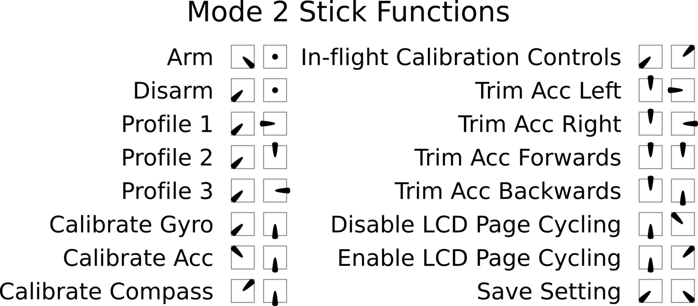

# Arming and Stick Commands

## Arming

When armed, the aircraft is ready to fly and the motor will spin when throttle is applied.

By default, arming and disarming is done with stick positions. (This is disabled when a switch is
used to arm; see the `ARM` mode in [Modes](../configurator/tabs/auxiliary.md).)

## Arming disable flags

If the aircraft will not arm, open the [Status tab](../configurator/tabs/status.md), or connect to the CLI and run
`status`. The "Arming disable flags" line lists the reasons:

| Flag | Meaning |
|---|---|
| `NOGYRO` | No gyro detected |
| `RXLOSS`, `BADRX` | No valid receiver signal, or the arm switch was on when the receiver signal returned |
| `FAILSAFE`, `BOXFAILSAFE` | A failsafe event, or the `FAILSAFE` switch is on |
| `THROTTLE` | Throttle is not at its lowest position |
| `ANGLE` | The attitude estimate is not ready yet |
| `BOOTGRACE` | Still inside the power-on grace time |
| `NOPREARM` | `PREARM` is configured and its switch is not on |
| `LOAD` | The system is overloaded |
| `CALIB` | Sensor calibration is running |
| `CLI` | The CLI is active |
| `MSP` | Arming has been blocked over MSP (for example by the Configurator) |
| `PARALYZE` | The `PARALYZE` mode is on |
| `NO_ACC_CAL` | The accelerometer has not been calibrated |
| `MOTOR_PROTO` | The motor protocol is not valid |
| `OVERRIDE` | A mixer or servo override is active |
| `ARMSWITCH` | Arming was attempted while another flag was set. Switch the arm switch off, and on again once the other flags clear |

## Stick commands

The three stick positions are:

| Position | Approx. channel input |
|---|---|
| LOW | 1000 |
| CENTER | 1500 |
| HIGH | 2000 |

The stick positions are combined to give these commands. They work only while disarmed, except
arming and disarming, and are ignored when the `STICK COMMANDS DISABLE` mode is on.

| Function | Throttle | Yaw | Pitch | Roll |
|---|---|---|---|---|
| ARM | LOW | HIGH | CENTER | CENTER |
| DISARM | LOW | LOW | CENTER | CENTER |
| Select PID profile 1 | LOW | LOW | CENTER | LOW |
| Select PID profile 2 | LOW | LOW | HIGH | CENTER |
| Select PID profile 3 | LOW | LOW | CENTER | HIGH |
| Calibrate gyro | LOW | LOW | LOW | CENTER |
| Calibrate accelerometer | HIGH | LOW | LOW | CENTER |
| Calibrate magnetometer | HIGH | HIGH | LOW | CENTER |
| Save settings | LOW | LOW | LOW | HIGH |
| Disable display page cycling | LOW | CENTER | HIGH | LOW |
| Enable display page cycling | LOW | CENTER | HIGH | HIGH |

When ANGLE or HORIZON is active, throttle HIGH and yaw CENTER trims the accelerometer level
reference with the sticks:

| Function | Pitch | Roll |
|---|---|---|
| Trim pitch up one step | HIGH | CENTER |
| Trim pitch down one step | LOW | CENTER |
| Trim roll right one step | CENTER | HIGH |
| Trim roll left one step | CENTER | LOW |

When neither is active (plain acro), the same throttle HIGH and yaw CENTER positions select the
**rate profile** instead:

| Rate profile | Pitch | Roll |
|---|---|---|
| 1 | HIGH | CENTER |
| 2 | LOW | CENTER |
| 3 | CENTER | HIGH |
| 4 | CENTER | LOW |

### History

The initial stick commands came from MultiWii. The original documents can be found at
https://code.google.com/archive/p/multiwii/source/default/source.

