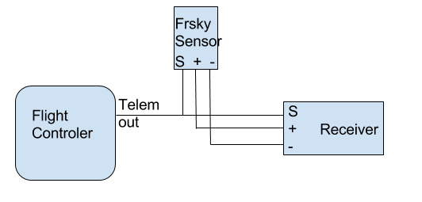

# Telemetry

Telemetry allows you to know what is happening on your aircraft while you are flying it.  Among other things you can receive battery voltages and GPS positions on your transmitter.

Telemetry can be either always on, or enabled when armed.  If a serial port for telemetry is shared with other functionality then telemetry will only be enabled when armed on that port.

Telemetry is enabled using the `TELEMETRY` feature. It is on by default in new
and reset configurations.

```
feature TELEMETRY
```

## Telemetry sensors

The sensors sent to the radio over S.Port, F.Port, FBUS and custom CRSF are
chosen on the [Receiver tab](../configurator/tabs/receiver.md#telemetry-sensors),
or with the `telemetry_sensors` CLI setting (a list of sensor IDs, up to 40).

New and reset configurations select the sensors the WingFlight Lua suites use:

```
set telemetry_sensors = 3,4,5,6,15,43,50,52,58,59,60,89,91,99,120,121,0,0,0,0,0,0,0,0,0,0,0,0,0,0,0,0,0,0,0,0,0,0,0,0
```

| ID | Sensor | ID | Sensor |
|---|---|---|---|
| 3 | Battery voltage | 58 | Altitude |
| 4 | Battery current | 59 | Vario |
| 5 | Consumption (mAh) | 60 | Motor speed |
| 6 | Charge level (SmartFuel) | 89 | Flight mode |
| 15 | Throttle | 91 | Arming disable flags |
| 43 | BEC voltage | 99 | Adjustments |
| 50 | ESC temperature | 120 | System status |
| 52 | MCU temperature | 121 | System config |

The Ethos Lua suite's **Default** button writes the same list, so a model set
up either way shows no difference in `diff`. Existing configurations keep
their own list when you upgrade.

### CRSF telemetry mode

For CRSF (ELRS and Crossfire), `crsf_telemetry_mode` selects what is sent:

- `CUSTOM` (the default): the sensors selected above, which the WingFlight Lua
  suites decode.
- `NATIVE`: the standard CRSF frames (battery, attitude, altitude, GPS, flight
  mode, RPM and temperature) that any radio understands without a script.

### Status sensors

Two sensors carry the flight controller's status as bitfields, so a radio
script can read many flags from one sensor. The WingFlight Lua suites decode
them for their [callouts and dashboard alerts](radio-alerts.md).

| ID | Sensor | S.Port | CRSF | Sent every |
|---|---|---|---|---|
| 120 | System Status | `0x5140` | `0x1230` | 100 ms |
| 121 | System Config | `0x5141` | `0x1231` | 500 ms |

They replace the older arming flags (90), PID, rate, battery, LED and thrust
vector profile (95-98, 118) and GPS fix type (119) sensors, which are no
longer sent. Bit 31 of both words is never set, because S.Port sends the value
as a signed number.

**System Status (120)**

| Bits | Meaning |
|---|---|
| 0 | Armed |
| 1 | Airborne |
| 2 | Motors running |
| 3 | Main receiver has signal |
| 4 | Backup receiver has signal |
| 5 | Backup receiver in control (main receiver down) |
| 6-8 | Failsafe phase: 0 idle, 1 RX loss detected, 2 landing, 3 landed, 4 RX loss monitoring, 5 RX loss recovered, 6 GPS rescue |
| 9-10 | GPS fix: 0 none, 1 fix, 2 fix and home recorded |
| 11 | GPS module communicating |
| 12-13 | GPS mode blocked: 0 none, 1 Loiter switched on but can't fly, 2 RTH switched on but can't fly |
| 14-16 | Battery state: 0 OK, 1 warning, 2 critical, 3 not present, 4 initialising |
| 17 | Control surfaces at their limit (held for 500 ms) |
| 18 | Gyro overflow |
| 19 | Accelerometer not calibrated |
| 20 | Configurator test override active |
| 21 | A flight aid is holding (Attitude Hold, thrust vector hold, Auto Hover, or the Trainer limiting) |
| 22-23 | Auto Trim: 0 idle, 1 capturing, 2 captured, saved on disarm |
| 24 | Blackbox logging |
| 25-28 | Logic conditions 1-4 |

**System Config (121)**

| Bits | Meaning |
|---|---|
| 0-2 | PID profile (1-6) |
| 3-5 | Rate profile (1-6) |
| 6-8 | Battery profile (1-6) |
| 9-11 | Thrust vector profile (1-6) |
| 12 | Unsaved settings |
| 13 | Saving settings |
| 14 | Reboot required |
| 15 | Beeper sounding |
| 16 | Accelerometer present |
| 17 | Barometer present |
| 18 | Magnetometer present |
| 19 | GPS present |
| 20 | Backup receiver configured |
| 21 | Blackbox full |
| 22 | Motor RPM telemetry present |

**Manual decoding examples**

Read bit 0 from the right-hand end of the value. For multi-bit fields, read
the whole range as one number; for example, System Status bits 9-10 are the
GPS fix field, not two separate GPS flags.

| Sensor | Radio value | Bit string, bits 31-0 | Manual reading |
|---|---|---|---|
| System Status | `2568` (`0x00000A08`) | `00000000000000000000101000001000` | Bit 3 is set, so the main receiver has signal. Bits 9-10 read as `1`, so GPS has a fix. Bit 11 is set, so the GPS module is communicating. |
| System Status | `18893839` (`0x01204C0F`) | `00000001001000000100110000001111` | Bits 0-3 are set, so the aircraft is armed, airborne, motors are running and the main receiver has signal. Bits 9-10 read as `2`, so GPS has a fix and home is recorded. Bits 14-16 read as `1`, so battery state is warning. Bits 21 and 24 show an assist is holding and Blackbox is logging. |
| System Config | `1774154` (`0x001B124A`) | `00000000000110110001001001001010` | Bits 0-2 read as `2`, so PID profile 2 is active. Bits 3-5, 6-8 and 9-11 each read as `1`, so rate, battery and thrust-vector profile 1 are active. Bit 12 shows unsaved settings. Bits 16, 17, 19 and 20 show accelerometer, barometer and GPS present, with backup RX configured. |

Bit positions can change between firmware versions, together with the Lua
suites that decode them. Use matching firmware and Lua suite versions.

Multiple telemetry providers are currently supported: SmartPort (S.Port),
Graupner HoTT V4, Ibus, Jeti EX Bus and Futaba SBUS2, plus the telemetry built
into CRSF, F.PORT, FBUS and SRXL receivers.

FrSky Hub (D-series), LightTelemetry (LTM) and MAVLink telemetry are not
supported in WingFlight.

All telemetry systems use serial ports, configure serial ports to use the telemetry system required.

Some telemetry signals, such as FrSky SmartPort, are inverted. Use a flight controller with a built-in inverter or
software-configurable inversion, and set:

```
set tlm_inverted = ON
```

## HoTT telemetry

Only Electric Air Modules and GPS Modules are emulated.

Use the latest Graupner firmware for your transmitter and receiver.

Older HoTT transmitters required the EAM and GPS modules to be enabled in the telemetry menu of the transmitter. (e.g. on MX-20)

You can connect HoTT-Telemetry in two ways:

#### Old way:
Serial ports use two wires but HoTT uses a single wire so some electronics are required so that the signals don't get mixed up.  The TX  and RX pins of
a serial port should be connected using a diode and a single wire to the `T` port on a HoTT receiver.

Connect as follows:

* HoTT TX/RX `T` -> Serial RX (connect directly)
* HoTT TX/RX `T` -> Diode `-(  |)-` > Serial TX (connect via diode)

The diode should be arranged to allow the data signals to flow the right way

```
-(  |)- == Diode, | indicates cathode marker.
```

1N4148 diodes have been tested and work with the GR-24.

When using the diode disable `tlm_halfduplex`, go to CLI and type `set tlm_halfduplex = OFF`, don't forget a `save` afterwards.

#### New way:
You can use a single connection, connect HoTT RX/TX only to serial TX, leave serial RX open and make sure `tlm_halfduplex` is ON.

As noticed by Skrebber the GR-12 (and probably GR-16/24, too) are based on a PIC 24FJ64GA-002, which has 5V tolerant digital pins.

Note: The SoftSerial ports may not be 5V tolerant on your board.  Verify if you require a 5v/3.3v level shifters.

## SmartPort (S.Port)

Smartport is a telemetry system used by newer FrSky transmitters and receivers such as the Taranis/XJR and X8R, X6R and X4R(SB).

More information about the implementation can be found here: https://github.com/frank26080115/cleanflight/wiki/Using-Smart-Port

### Available sensors

The following sensors are transmitted :

| Name| Description|
| ----| -----------|
| A4 | average cell value. Warning : unlike FLVSS sensors, you do not get actual lowest value of a cell, but an average : (total lipo voltage) / (number of cells) |
| Alt | barometer based altitude, init level is zero. |
| Vspd | vertical speed, unit is cm/s. |
| Hdg | heading, North is 0°, South is 180°. |
| AccX,Y,Z | accelerometers values. |
| Tmp1 | actual flight mode, sent as 4 digits. Number is sent as (1)1234. Please ignore the leading 1, it is just there to ensure the number as always 5 digits (the 1 + 4 digits of actual data) the numbers are aditives (for example, if first digit after the leading 1 is 6, it means GPS Home and Headfree are both active) <ol><li>1 is GPS Hold, 2 is GPS Home, 4 is Headfree</li><li>1 is mag enabled, 2 is baro enabled, 4 is sonar enabled</li><li>3. 1 is angle, 2 is horizon, 4 is passthrough</li><li>4. 1 is ok to arm, 2 is arming is prevented,  4 is armed</li></ol> |
| Tmp2 | GPS lock status, Number is sent as 1234, the numbers are aditives<ol><li>1 is GPS Fix, 2 is GPS Home fix</li><li>HDOP (0-9, 0 is HDOP >= 5.5m, 9 is HDOP <= 1.0m)</li><li>number of sats</li><li>number of sats</li></ol> |
| VFAS | actual vbat value. |
| GAlt | GPS altitude, sea level is zero. |
| GSpd | current speed, calculated by GPS. |
| GPS | GPS coordinates. |
| 420 | GPS distance to home |
| Cels | average cell value, vbat divided by cell number. |

> WingFlight will send Cels (FLVSS Individual Cell Voltages Telemetry), disable the setting to use actual FLVSS sensor with:
> ```
> set report_cell_voltage = OFF
> ```
>
> Note: cell voltage values are an assumed reputation of the cell voltage based on the packs voltage. Actual cell voltage may differ. It is recommeded that you chain the flight controllers telemetry with a real Frsky FLVSS s.port sensor.
>
> To view individual cells or more importantly to get lowest cell (all cells are the sum of vbat, so each cell is the same in this case):
> See [OpenTX 2.1 & FrSky FLVSS Individual Cell Voltages](http://openrcforums.com/forum/viewtopic.php?t=7266).
> Add a new sensor, to display the lowest cell voltage set it up like this:
> - Type: Calculated
> - Formula: Cell
> - Cell Sensor: Cels _(pack total voltage, sum of all cells)_
> - Cell Index: Lowest

### Integrate WingFlight telemetry with FrSky Smartport sensors

While WingFlight telemetry brings a lot of valuable data to the radio, there are additional sensors, like Lipo cells sensor FLVSS, that can be a great addition for many aircrafts. Smartport sensors are designed to be daisy chained, and CF telemetry is no exception to that. To add an external sensor, just connect the "S" port of the FC and sensor(s) together, and ensure the sensor(s) are getting connected to GND and VCC either from the controler or the receiver



## S.Port master sensor input

Rotorflight can also poll external FrSky S.Port sensors directly on a dedicated bidirectional serial port. This is separate from `FUNCTION_TELEMETRY_SMARTPORT`, which sends flight controller telemetry out to the receiver or radio. `FUNCTION_SPORT_MASTER` makes the flight controller act as the S.Port bus master so external sensors can be read into the shared FBUS sensor cache.

### Configuration

1. Enable telemetry:

```
feature TELEMETRY
```

2. Assign a spare bidirectional serial port to `S.Port master` in Configurator. When using the `serial` CLI command directly, the function bit is `FUNCTION_SPORT_MASTER = 1048576`.
3. Connect the S.Port signal line to the selected UART on a target that supports bidirectional serial on that port. The bus runs at `57600`.
4. Adjust the line options if the selected UART needs different hardware settings:

```
set sport_master_inverted = ON
set sport_master_pinswap = ON
```

Both settings default to `ON`. Set `sport_master_inverted = OFF` when the selected port should use a non-inverted signal. Set `sport_master_pinswap = OFF` when the selected port should keep its normal TX/RX pin mapping.

### Observed sensor CLI

Use the `fbus_sensors` CLI command to inspect discovered sensors. The command now reports both FBUS and S.Port devices in the same table. The `Source` column shows `FBUS` or `SPORT`, and the same physical ID can appear once per source because the observed sensor cache is keyed by `(physical ID, source)`.

Use `fbus_sensors clear` to clear the observed sensor cache for both transports.

### Data consumers

Sensor data received through S.Port master feeds the same FBUS-backed consumers used elsewhere in the firmware, including `GPS_FBUS`, FBUS-backed voltage and current sensing, and `ESC_SENSOR_PROTO_FBUS`.


## Ibus telemetry

Ibus telemetry requires a single connection from the TX pin of a bidirectional serial port to the Ibus sens pin on an FlySky telemetry receiver. (tested with fs-iA6B receiver, iA10 should work)

It shares 1 line for both TX and RX, the rx pin cannot be used for other serial port stuff.
It runs at a fixed baud rate of 115200.

```
     _______
    /       \                                             /---------\
    | STM32 |--UART TX-->[Bi-directional @ 115200 baud]<--| IBUS RX |
    |  uC   |--UART RX--x[not connected]                  \---------/
    \_______/
```

It should be possible to daisy chain multiple sensors with ibus. This is implemented but not tested because i don't have one of the sensors to test with, the FC shall always be the last sensor in the chain.

It is possible to combine serial rx and ibus telemetry on the same uart pin on the flight controller, see [Rx](receivers.md).

### Configuration

Ibus telemetry can be enabled in the firmware at build time using defines in target.h. It is enabled by default in those targets that have space left.
```
#define TELEMETRY
#define TELEMETRY_IBUS
```

CLI command to enable:
```
serial 1 1024 115200 57600 115200 115200
```

CLI setting to determine if the voltage reported is Vbatt or calculated average cell voltage
```
set report_cell_voltage=[ON/OFF]
```

### Available sensors

The following sensors are transmitted :

Tmp1 : baro temp if available, gyro otherwise.

RPM : throttle value

Vbatt : configurable battery voltage or the average cell value, vbat divided by number of cells.

### RX hardware ###

These receivers are reported to work with i-bus telemetry:

- FlySky/Turnigy FS-iA6B 6-Channel Receiver (http://www.flysky-cn.com/products_detail/&productId=51.html)
- FlySky/Turnigy FS-iA10B 10-Channel Receiver (http://www.flysky-cn.com/products_detail/productId=52.html)


Note that the FlySky/Turnigy FS-iA4B 4-Channel Receiver (http://www.flysky-cn.com/products_detail/productId=46.html) seems to work but has a bug that might lose the binding, DO NOT FLY the FS-iA4B!


## Jeti EX Bus telemetry

If telemetry is to be used, only the telemetry feature needs to be activated.
The telemetry names will be transmitted for the first 5-10 seconds.

The following values are available:

| Name            | Unit|
| --------------- | ----|
| Voltage         | [V]|
| Current         | [A]|
| Altitude        | [m]|
| Capacity        | [mAh]|
| Power           | [W]|
| Roll angle      | [°]|
| Pitch angle     | [°]|
| Heading         | [°]|
| Vario           | [m/s]|
| GPS Sats        | [1]|
| GPS Long        | |
| GPS Lat         | |
| GPS Speed       | [m/s]|
| GPS H-Distance  | [m]|
| GPS H-Direction | [°]|
| GPS Heading     | [°]|
| GPS Altitude    | [m]|
| G-Force X       | |
| G-Force Y       | |
| G-Force Z       | |

The telemetry values that are transmitted depend on whether a suitable sensor is available.

| Value                                       | Sensor |
| ------------------------------------------- | ------ |
| Voltage                                     | Voltage measurement|
| Current                                     | Current measurement|
| Capacity and Power                          | Voltage & Current Measurement|
| Heading                                     | Magnetometer|
| Altitude and Vario                          | Barometer|
| Roll angle, pitch angle and G-Froce X, Y, Z | ACC|
| GPS Sats, GPS...                            | GPS|

## Futaba SBUS2 telemetry

SBUS2 telemetry requires a single connection from the TX pin of a bidirectional serial port to the SBUS2 port on a Futaba telemetry receiver. (tested with T16IZ radio and R7108SB / R3204SB receivers). The FPORT plug is the perfect candidate for this.

It shares 1 line for both TX and RX, the rx pin cannot be used for other serial port stuff.
It runs at a fixed baud rate of 100000 8e2.

```
     _______
    /       \                                             /----------\
    | STM32 |--UART TX-->[Bi-directional @ 100000 baud]<--| SBUS2 RX |
    |  uC   |--UART RX--x[not connected]                  \----------/
    \_______/
```

### Radio Configuration
The following sensors should setup on your radio and Gear ratio for RPM Sensor and Kontronik ESC to 1.00 in your radio.
| Slot | Sensort Type | Notes |
| --- | --- | --- |
| 1 | Voltage | FC Voltage sensor. Pack and cell voltages |
| 3 | Current | FC Current sensor. |
| 6 | RPM sensor | Headspeed |
| 7 | Temperature | MCU Core temp |
| 8 | Kontronic ESC | ESC telemetry data |
